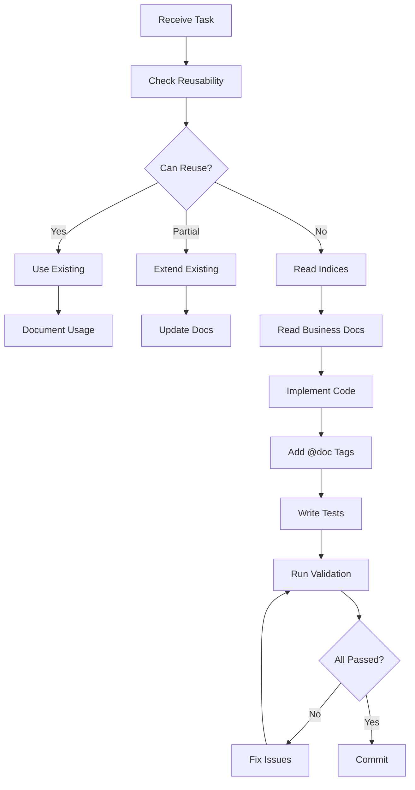

# AGENTS.md

This file provides comprehensive guidance to all AI Agents (Copilot, Cursor, Tabnine, Codeium, etc.) when working with code in this repository.

**Last Updated:** 2025-12-28
**Version:** 2.1.0
**Project:** Target Management & Visualization Platform (川分目标管理系统)

---

## 📋 Table of Contents

- [Scope and Objectives](#-scope-and-objectives)
- [Supported AI Agents](#-supported-ai-agents)
- [Project Overview](#-project-overview)
- [Quick Start](#-quick-start)
- [Technology Stack](#-technology-stack)
- [Architecture](#-architecture)
- [Core Principles](#-core-principles)
- [Knowledge Graph System](#-knowledge-graph-system)
- [Agent Workflows](#-agent-workflows)
- [Development Workflows](#-development-workflows)
- [Key Conventions](#-key-conventions)
- [Quality Standards](#-quality-standards)
- [Usage Scenarios](#-usage-scenarios)
- [Common Tasks](#-common-tasks)
- [Troubleshooting](#-troubleshooting)
- [Agent Integration Guide](#-agent-integration-guide)
- [Best Practices](#-best-practices)

---

## 🎯 Scope and Objectives

### Scope
- **适用范围**: 仓库内所有目录与文件均遵循本文档，除非更深层目录存在新的 `AGENTS.md` 覆盖
- **覆盖对象**: 所有 AI 辅助开发工具，包括 IDE 插件和命令行工具

### Objectives
- **质量保证**: 以 Codex 官方最佳实践审视并执行开发流程
- **复用优先**: 确保组件、逻辑、数据结构的最大化复用
- **索引驱动**: 通过知识图谱索引提供精确的上下文理解
- **验证闭环**: 自动验证确保代码质量和文档一致性
- **提交规范**: 遵循 Conventional Commits 规范

---

## 🤖 Supported AI Agents

本文档为以下 AI 工具提供统一的知识图谱访问接口：

### IDE集成工具
- **GitHub Copilot**: 代码补全、函数生成、测试编写
- **Cursor**: 智能编辑、重构建议、架构理解
- **Tabnine**: 上下文感知补全、团队模式学习
- **Codeium**: 免费代码补全、多语言支持

### 专用助手
- **Amazon CodeWhisperer**: AWS集成、安全扫描
- **Claude Code**: 完整的开发工作流、架构理解
- **Google Gemini**: 多模态分析、大规模推理

### 通用能力
所有 Agent 都可以访问：
- 知识图谱索引 (`docs/.meta/*.json`)
- 业务文档 (`docs/business/*.md`)
- 架构文档 (`docs/architecture/*.md`)
- 测试覆盖率数据
- 代码模式库

---

## 🎯 Project Overview

**Target Management & Visualization Platform** for Sichuan Branch (2025-2026)

A Next.js-based business intelligence platform for managing vehicle insurance targets with:

### Core Features
- **Multi-dimensional Target Allocation**: Annual → Monthly/Quarterly breakdown with configurable weights
- **Real-time Achievement Tracking**: Monthly/Quarterly/Annual achievement rates
- **Dual Time Progress Modes**: Linear vs Weighted vs 2025-Actual based calculations
- **Year-over-Year Growth Analytics**: Requires 2025 baseline data (6 metrics)
- **Organization Mode Flexibility**: Branch/Local/Remote/Single/Multi-org views
- **Large Screen Optimization**: 2400px PPT container width, 6-column KPI layout

### Business Context
- **14 Organizations**: 7 Local (Chengdu area) + 7 Remote (other cities)
- **5 Products**: auto, property, life, health, total
- **3 Time Progress Calculation Modes**:
  - Linear: Equal monthly distribution (month/12)
  - Weighted: Configurable monthly weights
  - 2025-Actual: Based on 2025 actual data distribution (most accurate)

---

## 🚀 Quick Start

### Prerequisites
- Node.js 18.17+ or 20.x (LTS)
- pnpm (recommended) or npm

### Development Commands

```bash
# Install dependencies
pnpm install

# Development server (http://localhost:3000)
pnpm dev

# Production build
pnpm build
pnpm start

# Code quality checks
pnpm typecheck          # TypeScript type checking
pnpm lint               # ESLint code linting

# Testing (CRITICAL - must run before commit)
pnpm test               # Run tests in watch mode
pnpm test:run           # Run all tests once
pnpm test:coverage      # Generate coverage report
pnpm test:ui            # Open Vitest UI

# Documentation system
pnpm docs:sync          # Sync documentation indices
pnpm docs:check         # Verify doc-code consistency
pnpm docs:fix           # Auto-fix consistency issues
pnpm docs:graph         # View knowledge graph
```

### First-Time Setup
1. Clone the repository
2. Run `pnpm install`
3. Run `pnpm docs:sync` to generate knowledge graph indices
4. Run `pnpm dev` to start development
5. Read `docs/.meta/QUICKSTART.md` for documentation system intro

---

## 🛠️ Technology Stack

| Category | Technology | Version | Purpose |
|----------|-----------|---------|---------|
| **Framework** | Next.js (App Router) | 14.2.0 | Full-stack React framework |
| **Language** | TypeScript | 5.4.0 | Type-safe development |
| **Testing** | Vitest + Testing Library | 4.0.16 | Unit & integration testing (143 tests, 100% pass rate) |
| **Styling** | Tailwind CSS | 3.4.0 | Utility-first CSS framework |
| **Charts** | ECharts + echarts-for-react | 5.5.0 | Data visualization |
| **Validation** | Zod | 3.23.8 | Schema validation |
| **CSV Parsing** | Papa Parse | 5.4.1 | CSV data import |
| **Build Tool** | Next.js bundler | Built-in | Production optimization |
| **Package Manager** | pnpm | 8+ | Fast, efficient dependency management |

---

## 🏗️ Architecture

### Layered Architecture Principle

The project follows **strict separation of concerns**:

```
┌─────────────────────────────────────────────────┐
│  Presentation Layer (app/)                      │
│  - Next.js pages and layouts                    │
│  - React components                             │
│  - User interactions                            │
├─────────────────────────────────────────────────┤
│  Domain Layer (domain/)                         │
│  - Pure business logic functions                │
│  - NO side effects, NO I/O                      │
│  - Implements business rules from docs/business │
│  - 100% test coverage (143 tests)               │
├─────────────────────────────────────────────────┤
│  Service Layer (services/)                      │
│  - Data loading (localStorage + JSON files)     │
│  - Side effects and I/O operations              │
├─────────────────────────────────────────────────┤
│  Schema Layer (schemas/)                        │
│  - Zod data contracts                           │
│  - Type definitions                             │
├─────────────────────────────────────────────────┤
│  Configuration Layer (config/)                  │
│  - Static configurations                        │
│  - Organization modes, weights                  │
└─────────────────────────────────────────────────┘
```

### Directory Structure

```
src/
├── app/                    # Next.js App Router (Presentation)
├── components/             # React UI Components
│   ├── charts/            # Chart components (ECharts wrappers)
│   ├── data/              # Data table components
│   ├── filters/           # Filter selectors
│   ├── kpi/               # KPI card components
│   └── ui/                # Base UI components
│
├── domain/                 # Pure Business Logic (CRITICAL)
│   ├── achievement.ts     # Achievement rate calculations
│   ├── allocation.ts      # Annual → Monthly/Quarterly allocation
│   ├── growth.ts          # YoY growth metrics (6 fields)
│   ├── time.ts            # Time progress calculations (3 modes)
│   └── __tests__/         # Domain layer tests (143 tests, 100% pass rate)
│
├── services/               # Data Services (Side Effects)
├── schemas/                # Data Contracts
├── config/                 # Static Configurations
├── lib/                    # Utilities
└── styles/                 # Global Styles

docs/                       # Documentation (Knowledge Graph)
├── .meta/                  # Auto-generated indices
│   ├── docs-index.json    # Documentation index
│   ├── code-index.json    # Code index
│   └── graph.json         # Knowledge graph
├── business/              # Business rules (AUTHORITY)
├── design/                # Design system specs
└── development/           # Development guides

tests/                      # Test Infrastructure (PROTECTED)
└── setup.ts               # Global test setup

vitest.config.ts            # Vitest configuration (PROTECTED)
```

---

## 🎯 Core Principles (Codex Best Practices)

### 原则0：复用优先（最高优先级，强制执行）

**CRITICAL**: 任何开发任务前，必须按以下优先级检查可复用资源：

```typescript
const REUSE_PRIORITY = [
  '1. UI 组件 (src/components/ui/, docs/design/组件设计规范.md)',
  '2. 数据结构 (src/schemas/, docs/business/指标定义规范.md)',
  '3. 业务逻辑 (src/domain/, src/lib/, docs/.meta/code-index.json)',
  '4. 配置数据 (public/data/, src/config/)',
  '5. 设计模式 (docs/design/)',
];
```

**复用决策流程：**

```typescript
function checkReusability(task: Task): ReuseDecision {
  // 1. 分析任务需求
  const requirements = analyzeRequirements(task);

  // 2. 按优先级检查可复用资源
  const checks = [
    checkUIComponents(requirements),      // UI组件
    checkDataStructures(requirements),    // 数据结构
    checkBusinessLogic(requirements),     // 业务逻辑
    checkConfigData(requirements),        // 配置数据
    checkDesignPatterns(requirements),    // 设计模式
  ];

  // 3. 评估复用可行性
  const reusable = checks.filter(c => c.found);
  const needNew = checks.filter(c => !c.found);

  return {
    canReuse: reusable.length > 0,
    reusable,
    needNew,
    action: determineAction(reusable, needNew),
  };
}
```

**复用决策矩阵：**

```yaml
完全复用 (matchScore >= 0.9):
  动作: 直接使用
  示例: SortButtonGroup 用于任何排序场景
  记录: 添加使用场景到组件文档

部分复用 (0.7 <= matchScore < 0.9):
  动作: 扩展现有组件
  示例: UniversalChart 配置为新图表类型
  记录: 更新组件配置文档

组合构建 (matchScore < 0.7):
  动作: 组合原子组件
  示例: 页面 = 多个UI组件 + 业务逻辑
  记录: 创建组合模式文档
```

### 原则1：索引优先（先读索引，再读代码）

**工作流程：**

```bash
# 传统方式（不推荐）
grep -r "function calculate" src/  # 盲目搜索
cat src/domain/time.ts             # 直接阅读

# 索引驱动方式（推荐）
cat docs/.meta/code-index.json | jq '.modules["src/domain/time.ts"]'
# 获取: documentedIn, usedBy, exports 等完整信息
cat docs/business/指标定义规范.md  # 阅读业务定义
cat src/domain/time.ts             # 带着理解阅读代码
```

**优势：**
- 📚 完整上下文：了解代码的业务背景和用途
- 🔗 依赖关系：知道哪些模块依赖此代码
- 📝 文档对齐：确保理解业务规范
- 🎯 精准定位：避免遗漏相关代码

### 原则2：双向追溯（代码 ↔ 索引 ↔ 文档）

**代码变更检查清单：**

```yaml
修改代码时:
  - [ ] 检查 code-index.json 中的 documentedIn 字段
  - [ ] 阅读相关业务文档
  - [ ] 理解业务规则和边界条件
  - [ ] 修改代码实现
  - [ ] 更新 JSDoc 注释
  - [ ] 更新业务文档（如有变更）
  - [ ] 运行 pnpm docs:sync
  - [ ] 验证索引更新

修改文档时:
  - [ ] 检查 docs-index.json 中的 implementedIn 字段
  - [ ] 更新所有实现文件
  - [ ] 更新 JSDoc 中的 @doc 标记
  - [ ] 更新相关测试
  - [ ] 运行 pnpm docs:check
  - [ ] 修复一致性问题
```

**禁止行为：**
- ❌ 只修改代码而不更新文档/索引
- ❌ 只修改文档而不更新代码/索引
- ❌ 跳过 `pnpm docs:check` 验证

### 原则3：自动验证（以脚本为准）

**验证流程：**

```bash
# 提交前必须运行的验证
pnpm typecheck    && echo "✅ TypeScript验证通过" ||  echo "❌ TypeScript错误"
pnpm docs:check   && echo "✅ 文档一致性验证通过" || echo "❌ 文档不一致"
pnpm test:run     && echo "✅ 所有测试通过" ||       echo "❌ 测试失败"
```

**自动化验证清单：**

```yaml
TypeScript验证:
  - [ ] 类型定义正确
  - [ ] 无编译错误
  - [ ] 导入导出正确

文档一致性:
  - [ ] JSDoc 注释完整
  - [ ] @doc 标记存在
  - [ ] @param/@returns 说明清楚
  - [ ] 业务文档已更新

测试验证:
  - [ ] 所有测试通过 (143/143)
  - [ ] 覆盖率不降低
  - [ ] 边界条件覆盖
  - [ ] null/undefined 处理

索引完整性:
  - [ ] code-index.json 已更新
  - [ ] docs-index.json 已更新
  - [ ] graph.json 关联正确
```

### 原则4：测试保护（强制执行，禁止删除）

**CRITICAL - 测试基础设施受到严格保护：**

```yaml
禁止删除的测试文件:
  - src/**/__tests__/*     # 所有测试文件（143个测试用例，100%通过率）
  - vitest.config.ts       # Vitest配置文件
  - tests/setup.ts         # 测试环境设置

禁止移除的测试脚本 (package.json):
  - test                   # 交互式测试
  - test:run               # 运行所有测试
  - test:coverage          # 生成覆盖率报告
  - test:watch             # 监听模式
  - test:ui                # 可视化界面

禁止移除的测试依赖:
  - vitest                 # 测试框架
  - @testing-library/*     # React测试工具
  - @vitest/*              # Vitest插件
  - jsdom                  # 浏览器环境模拟
```

**测试修改规则：**

```yaml
修改前必须:
  - 理解测试覆盖的业务逻辑
  - 检查测试的边界条件覆盖
  - 确认测试与业务文档的一致性
  - 分析修改的影响范围

修改后必须:
  - 运行 pnpm test 确保所有测试通过
  - 运行 pnpm test:coverage 确保覆盖率不降低
  - 更新相关的业务文档
  - 运行 pnpm docs:sync 更新索引

新增代码时:
  - Domain层函数必须添加对应测试
  - 测试必须覆盖正常场景和边界条件
  - 测试必须包含null/undefined处理
  - 测试覆盖率目标: Domain层100%
```

---

## 🗺️ Knowledge Graph System

### 索引文件结构

```json
// docs/.meta/docs-index.json (文档 → 代码映射)
{
  "documents": {
    "docs/business/指标定义规范.md": {
      "id": "doc-metrics-definition",
      "title": "指标字典与计算口径",
      "implementedIn": ["src/domain/time.ts", "src/domain/growth.ts"],
      "sections": {
        "时间进度": {
          "lines": "26-64",
          "implementedIn": ["src/domain/time.ts"]
        }
      }
    }
  }
}

// docs/.meta/code-index.json (代码 → 文档映射)
{
  "modules": {
    "src/domain/time.ts": {
      "id": "module-time",
      "type": "domain-logic",
      "exports": ["linearProgressYear", "weightedProgressYear", "actual2025ProgressYear"],
      "documentedIn": ["docs/business/指标定义规范.md:26-64"],
      "usedBy": ["src/app/page.tsx:7-15", "src/hooks/useProgress.ts:12"],
      "tests": ["src/domain/__tests__/time.test.ts"]
    }
  }
}

// docs/.meta/graph.json (知识图谱)
{
  "nodes": [
    {
      "id": "doc-metrics",
      "type": "doc",
      "label": "指标定义规范",
      "path": "docs/business/指标定义规范.md"
    },
    {
      "id": "code-time",
      "type": "code",
      "label": "time.ts",
      "path": "src/domain/time.ts"
    },
    {
      "id": "test-time",
      "type": "test",
      "label": "time.test.ts",
      "path": "src/domain/__tests__/time.test.ts"
    }
  ],
  "edges": [
    {
      "from": "doc-metrics",
      "to": "code-time",
      "type": "defines",
      "label": "定义业务规则"
    },
    {
      "from": "test-time",
      "to": "code-time",
      "type": "tests",
      "label": "测试覆盖"
    }
  ]
}
```

### Core Principle: Index-First Development

```
传统方式:
AI → 扫描整个代码库 → 猜测意图 → 生成代码 ❌

索引驱动方式:
AI → 读取索引 → 理解上下文 → 生成精确代码 ✅
```

### 使用索引系统

#### 场景1: 修改业务逻辑

```bash
# ❌ 错误方式: 直接修改代码
vim src/domain/time.ts

# ✅ 正确方式: 索引驱动
# Step 1: 查询代码索引
cat docs/.meta/code-index.json | jq '.modules["src/domain/time.ts"]'

# Step 2: 阅读业务文档
# 从 "documentedIn" 字段获取: "docs/business/指标定义规范.md:26-64"
cat docs/business/指标定义规范.md | sed -n '26,64p'

# Step 3: 理解业务逻辑
# 确认: 时间进度有3种计算模式（线性、权重、2025实际）

# Step 4: 检查测试
cat src/domain/__tests__/time.test.ts

# Step 5: 修改代码（带着完整理解）
vim src/domain/time.ts

# Step 6: 更新 @doc 标记

# Step 7: 验证
pnpm docs:check
pnpm test:run
```

#### 场景2: 更新业务定义

```bash
# ❌ 错误方式: 只更新文档
vim docs/business/指标定义规范.md

# ✅ 正确方式: 双向更新
# Step 1: 查询文档索引
cat docs/.meta/docs-index.json | jq '.documents["docs/business/指标定义规范.md"]'

# Step 2: 找到所有实现
# 从 "implementedIn" 字段获取所有实现文件

# Step 3: 更新所有实现文件
vim src/domain/time.ts
vim src/domain/growth.ts
# 更新 JSDoc 注释

# Step 4: 更新文档
vim docs/business/指标定义规范.md

# Step 5: 同步索引
pnpm docs:sync

# Step 6: 验证一致性
pnpm docs:check
```

#### 场景3: 理解项目结构

```bash
# 查看知识图谱
pnpm docs:graph

# 统计文档覆盖率
jq '.modules | to_entries | map(select(.value.documentedIn == [])) | length' \
  docs/.meta/code-index.json
# 输出: 未文档化的模块数量

# 查找孤立文档
jq '.documents | to_entries | map(select(.value.implementedIn == [])) | length' \
  docs/.meta/docs-index.json
# 输出: 无实现的文档数量
```

---

## 🔄 Agent Workflows

### 阶段0: 复用检查 (必须首先执行)

```typescript
/**
 * Reusability check workflow
 *
 * CRITICAL: Must run BEFORE any implementation
 */
async function checkReusability(task: Task): Promise<ReuseCheckResult> {
  // 1. 分析任务需求
  const requirements = analyzeRequirements(task);

  // 2. 按优先级检查可复用资源
  const uiComponents = await searchUIComponents(requirements);
  const dataStructures = await searchDataStructures(requirements);
  const businessLogic = await searchBusinessLogic(requirements);
  const configData = await searchConfigData(requirements);
  const designPatterns = await searchDesignPatterns(requirements);

  // 3. 计算匹配分数
  const scores = {
    ui: calculateMatchScore(uiComponents, requirements.ui),
    data: calculateMatchScore(dataStructures, requirements.data),
    logic: calculateMatchScore(businessLogic, requirements.logic),
    config: calculateMatchScore(configData, requirements.config),
    pattern: calculateMatchScore(designPatterns, requirements.pattern),
  };

  // 4. 生成复用建议
  return generateReuseRecommendation(scores);
}

// 示例输出
{
  canReuse: true,
  reusable: [
    {
      type: 'UI组件',
      name: 'SortButtonGroup',
      location: 'src/components/ui/SortButtonGroup.tsx',
      matchScore: 0.95,
      reason: '完全符合需求，支持多种排序方式',
      usage: '导入后直接使用'
    }
  ],
  needNew: [],
  recommendation: '直接复用 SortButtonGroup 组件，无需创建新组件'
}
```

### 阶段1: 上下文理解

```typescript
/**
 * Context understanding workflow
 *
 * Use knowledge graph indices to build complete context
 */
async function understandContext(task: Task): Promise<Context> {
  // 1. 读取相关索引
  const codeIndex = await readJson('docs/.meta/code-index.json');
  const docsIndex = await readJson('docs/.meta/docs-index.json');
  const graphIndex = await readJson('docs/.meta/graph.json');

  // 2. 定位相关文件
  const relevantModules = findRelevantModules(task, codeIndex);
  const relevantDocs = findRelevantDocs(task, docsIndex);

  // 3. 理解业务上下文
  const businessContext = await extractBusinessContext(relevantDocs);

  // 4. 分析依赖关系
  const dependencies = analyzeDependencies(relevantModules, graphIndex);

  return {
    modules: relevantModules,
    docs: relevantDocs,
    business: businessContext,
    dependencies,
  };
}
```

### 阶段2: 代码生成

```typescript
/**
 * Code generation workflow
 *
 * Generate code following project patterns and business rules
 */
async function generateCode(context: Context): Promise<GeneratedCode> {
  // 1. 参考现有模式
  const patterns = extractPatterns(context.modules);

  // 2. 遵循业务定义
  const businessRules = context.business;

  // 3. 生成符合规范的代码
  const code = generateWithPatterns(patterns, businessRules);

  // 4. 生成 JSDoc 文档
  const docs = generateJSDoc(businessRules);

  // 5. 生成测试
  const tests = generateTests(businessRules);

  return {
    code,
    docs,
    tests,
    patterns: patterns.applied,
  };
}
```

### 阶段3: 自动验证

```typescript
/**
 * Automatic validation workflow
 *
 * Verify generated code meets all quality standards
 */
async function validate(generatedCode: GeneratedCode): Promise<ValidationResult> {
  // 1. TypeScript 类型检查
  const typeCheck = await runCommand('pnpm typecheck');

  // 2. 测试验证
  const testCheck = await runCommand('pnpm test:run');

  // 3. 文档一致性检查
  const docsCheck = await runCommand('pnpm docs:check');

  // 4. 代码质量检查
  const lintCheck = await runCommand('pnpm lint');

  // 5. 综合评估
  const allPassed = [typeCheck, testCheck, docsCheck, lintCheck].every(r => r.success);

  return {
    typeCheck,
    testCheck,
    docsCheck,
    lintCheck,
    passed: allPassed,
    summary: generateSummary([typeCheck, testCheck, docsCheck, lintCheck]),
  };
}
```

---

## 🔄 Development Workflows

### Critical Pattern: Documentation-Driven Development

**ALWAYS follow this workflow when modifying business logic:**



### Step-by-Step Workflow

#### 1. Before Making Changes

```bash
# For business logic changes
1. Run reusability check
2. Read docs/.meta/code-index.json
3. Find the file → check "documentedIn" field
4. Read the business documentation
5. Understand the business rules
6. Check for existing tests
7. Then modify code

# For documentation changes
1. Read docs/.meta/docs-index.json
2. Find the doc → check "implementedIn" field
3. Update all implementing code
4. Update JSDoc comments
5. Run pnpm docs:sync
```

#### 2. Making Changes

```typescript
// ✅ CORRECT: Complete documentation
/**
 * Calculate year-over-year growth rate
 *
 * @doc docs/business/指标定义规范.md:69
 * @formula (current - baseline) / baseline
 *
 * @param current Current period value
 * @param baseline Baseline period value
 * @returns Growth rate (0-1) or null if baseline is 0
 *
 * @example
 * const rate = calculateGrowthRate(120, 100);  // Returns 0.2
 * const noBase = calculateGrowthRate(120, 0);  // Returns null
 *
 * @tested src/domain/__tests__/growth.test.ts
 */
export function calculateGrowthRate(
  current: number,
  baseline: number
): number | null {
  if (baseline === 0) return null;  // Null-safe per business rules
  return (current - baseline) / baseline;
}

// ❌ WRONG: No documentation, no @doc tag
export function calculateGrowthRate(current: number, baseline: number) {
  return (current - baseline) / baseline;
}
```

#### 3. After Making Changes

```bash
# Required checks before commit
pnpm test:run         # Must pass all 143 tests
pnpm typecheck        # TypeScript validation
pnpm docs:check       # Doc-code consistency
git status docs/.meta/  # Verify index updates

# Commit format
git add src/domain/growth.ts
git add src/domain/__tests__/growth.test.ts
git add docs/business/指标定义规范.md
git add docs/.meta/*.json  # Include index updates
git commit -m "feat(domain): add growth rate calculation"
```

---

## 🔑 Key Conventions

### 1. Data Loading Priority (3-Tier Pattern)

**CRITICAL**: All data loaders follow this fallback order:

```typescript
localStorage (user import) → public/data (defaults) → fallback (empty)
```

Example from `src/services/loaders.ts:111-129`:

```typescript
export function loadActualsMonthly2025(): MonthlyActualRecord[] {
  // Tier 1: Check localStorage (user imported)
  const stored = storage.get('actuals_monthly_2025');
  if (stored) {
    return parseAndValidate(stored, MonthlyActualRecordSchema);
  }

  // Tier 2: Load from public/data (static defaults)
  const staticData = fetchStaticData('/data/actuals_monthly_2025.json');
  if (staticData) {
    return parseAndValidate(staticData, MonthlyActualRecordSchema);
  }

  // Tier 3: Fallback to empty array
  return [];
}
```

**Never hardcode data values** - all business data comes from JSON files or user imports.

### 2. Null Safety (Strict Financial Discipline)

**Business Rule**: If a calculation is impossible (division by zero, missing baseline), return `null` - NEVER `0`.

```typescript
// ✅ CORRECT: Null-safe calculation
export function calculateAchievementRate(
  actual: number,
  target: number
): number | null {
  if (target === 0) return null;  // Can't calculate
  return actual / target;
}

// ❌ WRONG: Returning 0 misrepresents data
export function calculateAchievementRate(actual: number, target: number): number {
  if (target === 0) return 0;  // ❌ Implies 0% achievement
  return actual / target;
}
```

**UI Handling**: Display `null` values as "—" (em dash) in the interface.

### 3. Domain Layer Requirements

**Every exported function in `src/domain/` MUST have:**

```typescript
/**
 * [Clear description]
 *
 * @doc docs/business/[file].md:[line]  ← REQUIRED
 * @formula [mathematical formula if applicable]
 *
 * @param [name] [description]
 * @returns [description, including null cases]
 *
 * @example
 * [usage example]
 *
 * @tested src/domain/__tests__/[file].test.ts  ← Test reference
 */
export function functionName(...) {
  // Implementation
}
```

---

## ✅ Quality Standards

### Domain Layer Checklist

Every function in `src/domain/` must have:

- ✅ Complete JSDoc comment
- ✅ `@doc` tag pointing to business documentation
- ✅ `@formula` tag (if mathematical formula exists)
- ✅ `@param` and `@returns` descriptions
- ✅ `@example` usage example
- ✅ `@tested` tag pointing to test file
- ✅ Business documentation has corresponding definition
- ✅ Entry in docs/.meta/code-index.json
- ✅ Null-safe error handling
- ✅ Corresponding test coverage (100% for core functions)

### Code Quality Metrics

```bash
# Type safety
pnpm typecheck          # Must pass with 0 errors

# Testing
pnpm test:run           # Must pass 143/143 tests
pnpm test:coverage      # Domain layer: 100% target

# Documentation consistency
pnpm docs:check         # Must pass with 0 warnings
```

### Quality Targets

| Metric | Target | Critical? |
|--------|--------|-----------|
| Documentation coverage (domain) | 100% | ✅ Yes |
| Test coverage (domain core) | 100% | ✅ Yes |
| Test pass rate | 100% (143/143) | ✅ Yes |
| TypeScript errors | 0 | ✅ Yes |
| Documentation consistency | 100% | ✅ Yes |

---

## 📖 Usage Scenarios

### Scenario 1: Auto-completion (Copilot/Cursor/Tabnine)

```typescript
// User starts typing
export function calculate

// Agent思考过程:
// 1. 识别到 domain 层 (根据文件路径)
// 2. 查询 code-index.json 寻找相似函数
// 3. 读取 docs/business/指标定义规范.md 理解业务需求
// 4. 参考现有函数的模式
// 5. 生成符合规范的代码

// Agent补全:
/**
 * 计算时间进度
 *
 * @doc docs/business/指标定义规范.md:XX
 * @param month 当前月份（1-12）
 * @returns 进度值（0-1）
 *
 * @example
 * const progress = calculateTimeProgress(6);  // Returns 0.5
 *
 * @tested src/domain/__tests__/time.test.ts
 */
export function calculateTimeProgress(month: number): number {
  // 基于索引理解，生成正确的逻辑
  const clampedMonth = Math.max(1, Math.min(12, month));
  return clampedMonth / 12;
}
```

### Scenario 2: Refactoring Suggestions (All Agents)

```typescript
// User selects code
function oldCalculate(a, b) {
  return a / b;
}

// Agent分析:
// 1. 查询 code-index 找到该函数的文档
// 2. 读取 docs/business/指标定义规范.md
// 3. 发现缺少:
//    - null 处理
//    - 类型注解
//    - JSDoc 文档
//    - @doc 标记
// 4. 提供重构建议

// Agent建议:
/**
 * 根据 docs/business/指标定义规范.md:XX
 * 该函数需要处理除零情况
 *
 * @doc docs/business/指标定义规范.md:XX
 * @param a 被除数
 * @param b 除数
 * @returns 计算结果，除数为0时返回null
 */
function calculate(a: number, b: number): number | null {
  if (b === 0) return null;  // 根据业务规范
  return a / b;
}
```

### Scenario 3: Test Generation (All Agents)

```typescript
// Agent 读取索引后，理解:
// 1. 函数的业务定义 (从 @doc 标记)
// 2. 边界条件 (从业务文档)
// 3. null 处理策略 (从代码模式)

// Agent 生成测试:
describe('actual2025ProgressYear', () => {
  it('应正确计算前6个月的进度', () => {
    const actuals = [
      100, 100, 100, 100, 100, 100,  // 前6个月: 600
      200, 200, 200, 200, 200, 200   // 后6个月: 1200
    ];
    const progress = actual2025ProgressYear(actuals, 6);
    // 前6个月累计 600，全年累计 1800
    expect(progress).toBeCloseTo(600 / 1800, 4);  // 0.333...
  });

  it('当全年数据为0时应返回0', () => {
    const actuals = Array(12).fill(0);
    const progress = actual2025ProgressYear(actuals, 6);
    expect(progress).toBe(0);
  });

  it('应正确处理包含null的数据', () => {
    const actuals = [100, null, 100, 200, null, 200, 280, 300, 320, 350, 380, 400];
    // Agent 根据业务规范知道 null 应该被视为 0
    const progress = actual2025ProgressYear(actuals, 3);
    expect(progress).toBeGreaterThan(0);
  });

  it('应正确处理边界条件', () => {
    // 边界: 月份超出范围
    const actuals = [100, 120, 150, 200, 220, 250, 280, 300, 320, 350, 380, 400];
    const progress = actual2025ProgressYear(actuals, 15);
    expect(progress).toBeCloseTo(400 / 3070, 4); // 限制为12月
  });
});
```

### Scenario 4: Documentation Generation (All Agents)

```typescript
// 用户写了函数但没有文档
export function actual2025ProgressYear(actuals: (number | null)[], month: number) {
  if (actuals.length !== 12) return 0;
  const yearTotal = actuals.reduce((sum, v) => sum + (v ?? 0), 0);
  if (yearTotal === 0) return 0;
  const elapsed = actuals.slice(0, month).reduce((sum, v) => sum + (v ?? 0), 0);
  return elapsed / yearTotal;
}

// Agent分析:
// 1. 查询 docs-index 找相关业务文档
// 2. 查询 code-index 找相似函数
// 3. 理解函数逻辑
// 4. 匹配业务定义
// 5. 生成完整文档

// Agent补充:
/**
 * 年度2025实际进度
 *
 * 基于2025年实际数据计算当前月份的时间进度。
 * 这是三种时间进度口径之一，最贴近真实业务节奏。
 *
 * @doc docs/business/指标定义规范.md:31
 * @formula sum(actuals2025[0..month-1]) / sum(actuals2025[0..11])
 *
 * @param actuals 2025年12个月实际数据数组（可能包含null）
 * @param month 当前月份（1-12）
 * @returns 进度值（0-1），如果数据不足返回0
 *
 * @example
 * const actuals = [100, 110, 120, 130, 140, 150, 160, 170, 180, 190, 200, 210];
 * const progress = actual2025ProgressYear(actuals, 6);
 * // 返回: (100+110+120+130+140+150) / 1860 = 0.403
 *
 * @tested src/domain/__tests__/time.test.ts:225-302
 */
export function actual2025ProgressYear(
  actuals: (number | null)[],
  month: number
): number {
  if (actuals.length !== 12) return 0;
  const yearTotal = actuals.reduce((sum, v) => sum + (v ?? 0), 0);
  if (yearTotal === 0) return 0;
  const clampedMonth = Math.max(1, Math.min(12, month));
  const elapsed = actuals.slice(0, clampedMonth).reduce((sum, v) => sum + (v ?? 0), 0);
  return elapsed / yearTotal;
}
```

---

## 📖 Common Tasks

### Task 1: Add New Business Metric

```bash
# Step 1: Check reusability
# Search for similar metrics in domain layer
grep -r "calculate" src/domain/

# Step 2: Read business documentation
cat docs/business/指标定义规范.md

# Step 3: Update business documentation
edit docs/business/指标定义规范.md
# Add clear definition with formula

# Step 4: Implement in domain layer
edit src/domain/[category].ts
# Add function with @doc tag

# Step 5: Write comprehensive tests
edit src/domain/__tests__/[category].test.ts
# Cover all edge cases, null handling, boundary conditions

# Step 6: Sync and validate
pnpm docs:sync
pnpm docs:check
pnpm typecheck
pnpm test:run

# Step 7: Verify index updates
git status docs/.meta/

# Step 8: Commit
git add src/domain/[category].ts
git add src/domain/__tests__/[category].test.ts
git add docs/business/指标定义规范.md
git add docs/.meta/*.json
git commit -m "feat(domain): add [metric name] calculation"
```

### Task 2: Modify Existing Calculation

```bash
# Step 1: Find documentation reference
jq '.modules["src/domain/time.ts"]' docs/.meta/code-index.json
# Note the "documentedIn" field

# Step 2: Read business definition
cat docs/business/指标定义规范.md | grep -A10 "time_progress"

# Step 3: Read existing tests
cat src/domain/__tests__/time.test.ts

# Step 4: Modify code with updated logic
edit src/domain/time.ts
# Update implementation and JSDoc

# Step 5: Update tests
edit src/domain/__tests__/time.test.ts

# Step 6: Update documentation if business logic changed
edit docs/business/指标定义规范.md

# Step 7: Validate
pnpm docs:sync
pnpm docs:check
pnpm typecheck
pnpm test:run
```

### Task 3: Add Reusable Component

```bash
# Step 1: Check if similar component exists
grep -r "Button" src/components/ui/

# Step 2: If exists, decide: extend or reuse
# If matchScore >= 0.9, reuse directly
# If 0.7 <= matchScore < 0.9, extend
# If matchScore < 0.7, create new

# Step 3: Create component following patterns
create src/components/ui/[ComponentName].tsx
# Use existing patterns from similar components

# Step 4: Add to component index
edit docs/design/组件索引.md

# Step 5: Create usage example
create src/app/design-system/[component]-example.tsx

# Step 6: Test
pnpm dev
# Verify in design system showcase
```

---

## 🐛 Troubleshooting

### Documentation Sync Issues

```bash
# Problem: Indices are out of sync
pnpm docs:sync --force

# Problem: Broken links detected
pnpm docs:check
# Read error report, fix manually

# Problem: Circular references
jq '.edges[] | select(.type == "circular")' docs/.meta/graph.json
# Refactor to break cycle
```

### Build Failures

```bash
# TypeScript errors
pnpm typecheck
# Fix type errors before proceeding

# Next.js build errors
rm -rf .next
pnpm build
# Check error messages

# Dependency issues
rm -rf node_modules pnpm-lock.yaml
pnpm install
```

### Test Failures

```bash
# Run tests with verbose output
pnpm test:run --reporter=verbose

# Check specific test file
pnpm test src/domain/__tests__/time.test.ts

# Generate coverage report to find gaps
pnpm test:coverage

# Debug test in UI
pnpm test:ui
```

---

## 🛠️ Agent Integration Guide

### Step 1: Configure Environment

```bash
# 1. Ensure index files exist
pnpm docs:sync

# 2. Configure AI Agent access
# In .vscode/settings.json or equivalent:
{
  "ai.indexPath": "docs/.meta",
  "ai.contextFiles": [
    "docs/.meta/code-index.json",
    "docs/.meta/docs-index.json",
    "docs/.meta/ai-context.md"
  ],
  "ai.businessDocsPath": "docs/business",
  "ai.testPath": "src/**/__tests__"
}
```

### Step 2: Provide Context to Agent

```typescript
// In AI Agent's system prompt, include:
const contextPrompt = `
你正在协助开发一个使用知识图谱索引系统的项目。

重要文件：
- docs/.meta/code-index.json  # 代码索引
- docs/.meta/docs-index.json  # 文档索引
- docs/.meta/graph.json       # 知识图谱

工作流程：
1. 先检查可复用资源（原则0）
2. 读取相关索引文件（原则1）
3. 理解业务上下文
4. 生成符合规范的代码
5. 自动添加 @doc 标记
6. 运行自动验证（原则3）

质量要求：
- Domain 层必须有完整文档
- 必须包含 @doc 标记
- 必须包含 @formula（如有公式）
- 必须包含 @tested 标记
- 必须处理边界条件和 null 值
- 必须有对应的测试（100%覆盖率）
`;
```

### Step 3: Verification Mechanism

```bash
# Agent 生成代码后，自动运行
pnpm typecheck  && \
pnpm docs:check && \
pnpm test:run   && \
echo "✅ 代码生成成功，所有验证通过"
```

---

## 💡 Best Practices

### Practice 1: Context Injection

```typescript
// ✅ Good practice
// Agent reads indices first to understand context
const context = await loadContext('time_progress');
const code = generateCode(context);

// ❌ Bad practice
// Agent generates directly, may deviate from business rules
const code = generateCodeDirectly();
```

### Practice 2: Pattern Learning

```typescript
// ✅ Good practice
// Agent learns from existing patterns
const patterns = extractPatterns(existingCode);
const newCode = applyPatterns(patterns, newRequirement);

// ❌ Bad practice
// Agent uses generic templates, doesn't match project style
const newCode = useGenericTemplate();
```

### Practice 3: Incremental Validation

```typescript
// ✅ Good practice
// Validate after each small change
generateFunction()
  .then(validate)
  .then(generateTests)
  .then(validate)
  .then(updateDocs)
  .then(validate);

// ❌ Bad practice
// Generate lots of code then validate
generateAllCode()
  .then(validateAll);  // Too many errors, hard to fix
```

---

## 📝 Key Reminders

### ALWAYS
- ✅ **Check reusability first** - Search existing components/logic
- ✅ **Read indices before code** - Understand context fully
- ✅ **Follow business documentation** - Implement rules correctly
- ✅ **Add complete JSDoc** - Include @doc, @formula, @tested tags
- ✅ **Write comprehensive tests** - Cover edge cases and null handling
- ✅ **Run all validations** - typecheck, docs:check, test:run
- ✅ **Include index updates in commits** - docs/.meta/*.json
- ✅ **Use `git mv` when moving files** - Preserve history

### NEVER
- ❌ **Hardcode business data values** in code
- ❌ **Return `0` when calculation is impossible** (use `null`)
- ❌ **Skip @doc tags** in domain layer
- ❌ **Modify code without reading business documentation**
- ❌ **Commit without running validations**
- ❌ **Delete and recreate files** (use `git mv`)
- ❌ **Ignore validation warnings**
- ❌ **Delete test files or infrastructure** (vitest.config.ts, tests/setup.ts, __tests__/*)
- ❌ **Remove test scripts** (test, test:run, test:coverage, test:watch, test:ui)
- ❌ **Remove test dependencies** (vitest, @testing-library/*, @vitest/*, jsdom)
- ❌ **Modify tests without understanding their business logic**
- ❌ **Create new components without checking reusability**
- ❌ **Work on incomplete context**

---

## 📞 Support

### Documentation Issues
- Check `docs/.meta/QUICKSTART.md` FAQ section
- Search project issues for similar problems
- Run `pnpm docs:check` for detailed error reports

### Development Questions
- Consult `docs/development/开发指南.md`
- Check `docs/.meta/ai-context.md` for AI-assisted workflows
- Review knowledge graph: `pnpm docs:graph`

### Architecture Questions
- Read `docs/architecture/系统架构设计.md`
- Read `docs/architecture/业务架构设计.md`
- Review `docs/architecture/文档代码索引系统设计.md`

---

**Maintainers**: Development Team
**Version**: 2.1.0
**Last Updated**: 2025-12-28
**License**: Private

**Related Files**:
- `CLAUDE.md` - Claude Code specific guide
- `GEMINI.md` - Gemini-specific guide
- `README.md` - User-facing project documentation

---

**让 AI Agents 成为你的得力助手，而不是增加混乱！** 🤖✨

**遵循索引驱动、复用优先、测试保护的原则，打造高质量代码！** 🚀
