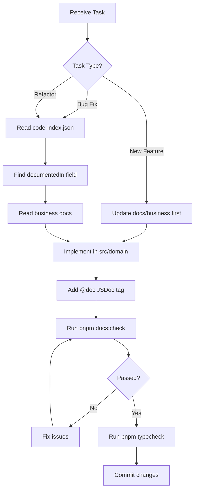
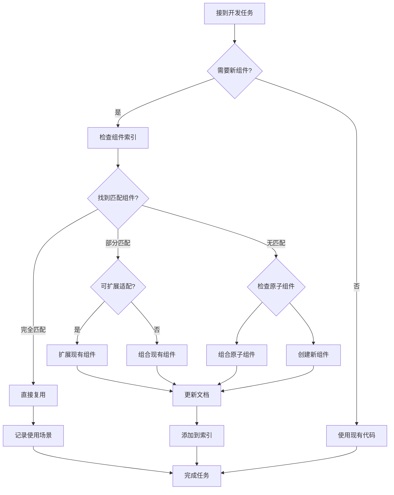

# CLAUDE.md

This file provides comprehensive guidance to Claude Code (claude.ai/code) when working with code in this repository.

**Last Updated:** 2025-12-23
**Version:** 2.0.0
**Project:** Target Management & Visualization Platform (川分目标管理系统)

---

## 📋 Table of Contents

- [Project Overview](#-project-overview)
- [Quick Start](#-quick-start)
- [Technology Stack](#-technology-stack)
- [Architecture](#-architecture)
- [Development Workflows](#-development-workflows)
- [Documentation System](#-documentation-system-knowledge-graph)
- [Key Conventions](#-key-conventions)
- [Quality Standards](#-quality-standards)
- [CI/CD Pipeline](#-cicd-pipeline)
- [Common Tasks](#-common-tasks)
- [Troubleshooting](#-troubleshooting)

---

## 🎯 Project Overview

**Target Management & Visualization Platform** for Sichuan Branch (2025-2026)

A Next.js-based business intelligence platform for managing vehicle insurance targets with:

### Core Features
- **Multi-dimensional Target Allocation**: Annual → Monthly/Quarterly breakdown with configurable weights
- **Real-time Achievement Tracking**: Monthly/Quarterly/Annual achievement rates
- **Dual Time Progress Modes**: Linear vs Weighted vs 2025-Actual based calculations
- **Year-over-Year Growth Analytics**: Requires 2025 baseline data (6 metrics)
- **Organization Mode Flexibility**: Branch/Local/Remote/Single/Multi-org views
- **Large Screen Optimization**: 2400px PPT container width, 6-column KPI layout

### Business Context
- **14 Organizations**: 7 Local (Chengdu area) + 7 Remote (other cities)
- **5 Products**: auto, property, life, health, total
- **3 Time Progress Calculation Modes**:
  - Linear: Equal monthly distribution (month/12)
  - Weighted: Configurable monthly weights
  - 2025-Actual: Based on 2025 actual data distribution (most accurate)

---

## 🚀 Quick Start

### Prerequisites
- Node.js 18.17+ or 20.x (LTS)
- pnpm (recommended) or npm

### Development Commands

```bash
# Install dependencies
pnpm install

# Development server (http://localhost:3000)
pnpm dev

# Production build
pnpm build
pnpm start

# Code quality checks
pnpm typecheck          # TypeScript type checking
pnpm lint               # ESLint code linting

# Documentation system
pnpm docs:sync          # Sync documentation indices
pnpm docs:check         # Verify doc-code consistency
pnpm docs:fix           # Auto-fix consistency issues
pnpm docs:graph         # View knowledge graph
```

### First-Time Setup
1. Clone the repository
2. Run `pnpm install`
3. Run `pnpm docs:sync` to generate knowledge graph indices
4. Run `pnpm dev` to start development
5. Read `docs/.meta/QUICKSTART.md` for documentation system intro

---

## 🛠️ Technology Stack

| Category | Technology | Version | Purpose |
|----------|-----------|---------|---------|
| **Framework** | Next.js (App Router) | 14.2.0 | Full-stack React framework |
| **Language** | TypeScript | 5.4.0 | Type-safe development |
| **Styling** | Tailwind CSS | 3.4.0 | Utility-first CSS framework |
| **Charts** | ECharts + echarts-for-react | 5.5.0 | Data visualization |
| **Validation** | Zod | 3.23.8 | Schema validation |
| **CSV Parsing** | Papa Parse | 5.4.1 | CSV data import |
| **Build Tool** | Next.js bundler | Built-in | Production optimization |
| **Package Manager** | pnpm | 8+ | Fast, efficient dependency management |

---

## 🏗️ Architecture

### Layered Architecture Principle

The project follows **strict separation of concerns**:

```
┌─────────────────────────────────────────────────┐
│  Presentation Layer (app/)                      │
│  - Next.js pages and layouts                    │
│  - React components                             │
│  - User interactions                            │
├─────────────────────────────────────────────────┤
│  Domain Layer (domain/)                         │
│  - Pure business logic functions                │
│  - NO side effects, NO I/O                      │
│  - Implements business rules from docs/business │
├─────────────────────────────────────────────────┤
│  Service Layer (services/)                      │
│  - Data loading (localStorage + JSON files)     │
│  - Side effects and I/O operations              │
├─────────────────────────────────────────────────┤
│  Schema Layer (schemas/)                        │
│  - Zod data contracts                           │
│  - Type definitions                             │
├─────────────────────────────────────────────────┤
│  Configuration Layer (config/)                  │
│  - Static configurations                        │
│  - Organization modes, weights                  │
└─────────────────────────────────────────────────┘
```

### Directory Structure

```
src/
├── app/                    # Next.js App Router (Presentation)
│   ├── page.tsx           # Main dashboard
│   ├── layout.tsx         # Root layout
│   ├── orgs/              # Organization pages
│   │   └── [org_id]/      # Dynamic org detail
│   ├── data/              # Data management page
│   ├── import/            # CSV import page
│   ├── rules/             # Rules configuration
│   └── design-system/     # Design system showcase
│
├── components/             # React UI Components
│   ├── charts/            # Chart components (ECharts wrappers)
│   ├── data/              # Data table components
│   ├── feedback/          # Loading, empty states
│   ├── filters/           # Filter selectors
│   ├── kpi/               # KPI card components
│   ├── layout/            # Layout components
│   └── ui/                # Base UI components
│
├── domain/                 # Pure Business Logic (CRITICAL)
│   ├── achievement.ts     # Achievement rate calculations
│   ├── aggregate.ts       # Data aggregation logic
│   ├── allocation.ts      # Annual → Monthly/Quarterly allocation
│   ├── growth.ts          # YoY growth metrics (6 fields)
│   ├── time.ts            # Time progress calculations (3 modes)
│   ├── headquarters.ts    # HQ target prediction
│   └── validate.ts        # Business validation rules
│
├── services/               # Data Services (Side Effects)
│   ├── loaders.ts         # Data loading (3-tier priority)
│   └── storage.ts         # localStorage operations
│
├── schemas/                # Data Contracts
│   ├── schema.ts          # Zod schemas
│   └── types.ts           # TypeScript types
│
├── config/                 # Static Configurations
│   ├── organizationModes.ts  # 5 organization modes
│   └── progressWeights.ts    # Monthly/quarterly weights
│
├── lib/                    # Utilities
│   ├── utils.ts           # General utilities (cn, etc.)
│   └── paths.ts           # Path helpers
│
└── styles/                 # Global Styles
    └── tokens.ts          # Design tokens

docs/                       # Documentation (Knowledge Graph)
├── .meta/                  # Auto-generated indices
│   ├── README.md          # Index system overview
│   ├── QUICKSTART.md      # 5-minute quick start
│   ├── ai-context.md      # AI tools guide
│   ├── index-schema.md    # Index data structure
│   ├── docs-index.json    # Documentation index
│   ├── code-index.json    # Code index
│   └── graph.json         # Knowledge graph
├── architecture/           # Architecture docs
├── business/              # Business rules (AUTHORITY)
│   ├── 指标定义规范.md     # Metric definitions
│   └── 目标分配规则.md     # Allocation rules
├── design/                # Design system specs
├── development/           # Development guides
└── reference/             # API references

public/data/               # Static Data Files
├── orgs.json                          # Organization master data
├── targets_annual_2026.json           # 2026 annual targets
├── headquarters_targets_annual_2026.json  # HQ targets
├── actuals_annual_2025.json           # 2025 baseline actuals
├── actuals_monthly_2025.json          # 2025 monthly actuals
├── actuals_monthly_2026_template.json # 2026 monthly template
├── allocation_rules.json              # Weight allocation rules
└── field_mapping.json                 # Field name mappings

scripts/
└── sync-docs-code.ts      # Documentation-code sync tool

.github/workflows/
├── deploy.yml             # GitHub Pages deployment
└── docs-sync.yml          # Documentation sync CI
```

---

## 🔄 Development Workflows

### Critical Pattern: Documentation-Driven Development

**ALWAYS follow this workflow when modifying business logic:**



### Step-by-Step Workflow

#### 1. Before Making Changes

```bash
# For business logic changes
1. Read docs/.meta/code-index.json
2. Find the file → check "documentedIn" field
3. Read the business documentation
4. Understand the business rules
5. Then modify code

# For documentation changes
1. Read docs/.meta/docs-index.json
2. Find the doc → check "implementedIn" field
3. Update all implementing code
4. Update JSDoc comments
5. Run pnpm docs:sync
```

#### 2. Making Changes

```typescript
// ✅ CORRECT: Always include @doc tags in domain layer
/**
 * Calculate year-over-year growth rate
 *
 * @doc docs/business/指标定义规范.md:69
 * @formula (current - baseline) / baseline
 *
 * @param current Current period value
 * @param baseline Baseline period value
 * @returns Growth rate (0-1) or null if baseline is 0
 */
export function calculateGrowthRate(
  current: number,
  baseline: number
): number | null {
  if (baseline === 0) return null;  // Null-safe per business rules
  return (current - baseline) / baseline;
}

// ❌ WRONG: No documentation, no @doc tag
export function calculateGrowthRate(current: number, baseline: number) {
  return (current - baseline) / baseline;
}
```

#### 3. After Making Changes

```bash
# Required checks before commit
pnpm typecheck        # TypeScript validation
pnpm docs:check       # Doc-code consistency
git status docs/.meta/  # Verify index updates

# Commit format
git add src/domain/growth.ts
git add docs/business/指标定义规范.md
git add docs/.meta/*.json  # Include index updates
git commit -m "feat(domain): add growth rate calculation"
```

### File Movement/Refactoring

```bash
# CORRECT way to move files
git mv src/old/file.ts src/new/file.ts
pnpm docs:sync --update-refs
pnpm docs:check

# WRONG: Don't delete + create
# ❌ rm src/old/file.ts
# ❌ touch src/new/file.ts
```

---

## 📚 Documentation System (Knowledge Graph)

This project uses an **innovative documentation-code indexing system** that maintains a bidirectional knowledge graph between documentation and code.

### Core Principle: Index-First Development

```
Traditional Approach:
AI → Scan entire codebase → Guess intent → Generate code ❌

Index Approach:
AI → Read indices → Understand context → Generate precise code ✅
```

### Index Files (Auto-generated)

| File | Purpose | Usage |
|------|---------|-------|
| `docs/.meta/docs-index.json` | Document → Code mapping | Find which code implements a doc |
| `docs/.meta/code-index.json` | Code → Document mapping | Find which doc defines code logic |
| `docs/.meta/graph.json` | Full knowledge graph | Visualize dependencies |
| `docs/.meta/knowledge-graph.mmd` | Mermaid diagram | VS Code preview |

### Using the Index System

#### Scenario 1: Modifying Business Logic

```bash
# ❌ WRONG: Directly modify src/domain/time.ts
# ✅ CORRECT:
1. cat docs/.meta/code-index.json | jq '.modules["src/domain/time.ts"]'
2. Read "documentedIn": ["docs/business/指标定义规范.md:26-64"]
3. Read the business documentation
4. Understand business logic
5. Modify code with full context
6. Update @doc tags
7. Run pnpm docs:check
```

#### Scenario 2: Updating Business Definition

```bash
# ❌ WRONG: Only update doc, forget code
# ✅ CORRECT:
1. cat docs/.meta/docs-index.json | jq '.documents["docs/business/指标定义规范.md"]'
2. Check "implementedIn": ["src/domain/time.ts", ...]
3. Update ALL implementing files
4. Update JSDoc comments
5. Run pnpm docs:sync
6. Verify consistency
```

#### Scenario 3: Understanding Project Structure

```bash
# View knowledge graph
pnpm docs:graph

# Check documentation coverage
jq '.modules | to_entries | map(select(.value.documentedIn == [])) | length' docs/.meta/code-index.json

# Find orphaned docs
jq '.documents | to_entries | map(select(.value.implementedIn == [])) | length' docs/.meta/docs-index.json
```

### Documentation Entry Points

| Document | Purpose | When to Read |
|----------|---------|-------------|
| `docs/.meta/README.md` | Index system overview | First time setup |
| `docs/.meta/QUICKSTART.md` | 5-minute quick start | Daily usage |
| `docs/.meta/ai-context.md` | AI tools guide | Before any AI-assisted task |
| `docs/business/指标定义规范.md` | Metric definitions (AUTHORITY) | Modifying domain logic |
| `docs/business/目标分配规则.md` | Allocation rules | Modifying allocation logic |
| `docs/development/开发指南.md` | Development guide | Coding standards |
| `docs/design/全局设计规范.md` | Design system | UI/UX work |

---

## 🔑 Key Conventions

### 1. Data Loading Priority (3-Tier Pattern)

**CRITICAL**: All data loaders follow this fallback order:

```typescript
localStorage (user import) → public/data (defaults) → fallback (empty)
```

Example from `src/services/loaders.ts:111-129`:

```typescript
export function loadActualsMonthly2025(): MonthlyActualRecord[] {
  // Tier 1: Check localStorage (user imported)
  const stored = storage.get('actuals_monthly_2025');
  if (stored) {
    return parseAndValidate(stored, MonthlyActualRecordSchema);
  }

  // Tier 2: Load from public/data (static defaults)
  const staticData = fetchStaticData('/data/actuals_monthly_2025.json');
  if (staticData) {
    return parseAndValidate(staticData, MonthlyActualRecordSchema);
  }

  // Tier 3: Fallback to empty array
  return [];
}
```

**Never hardcode data values** - all business data comes from JSON files or user imports.

### 2. Null Safety (Strict Financial Discipline)

**Business Rule**: If a calculation is impossible (division by zero, missing baseline), return `null` - NEVER `0`.

```typescript
// ✅ CORRECT: Null-safe calculation
export function calculateAchievementRate(
  actual: number,
  target: number
): number | null {
  if (target === 0) return null;  // Can't calculate
  return actual / target;
}

// ❌ WRONG: Returning 0 misrepresents data
export function calculateAchievementRate(actual: number, target: number): number {
  if (target === 0) return 0;  // ❌ Implies 0% achievement
  return actual / target;
}
```

**UI Handling**: Display `null` values as "—" (em dash) in the interface.

### 3. Domain Layer Requirements

**Every exported function in `src/domain/` MUST have:**

```typescript
/**
 * [Clear description]
 *
 * @doc docs/business/[file].md:[line]  ← REQUIRED
 * @formula [mathematical formula if applicable]
 *
 * @param [name] [description]
 * @returns [description, including null cases]
 *
 * @example
 * [usage example]
 */
export function functionName(...) {
  // Implementation
}
```

### 4. Organization System

The platform supports **5 organization modes** (defined in `src/config/organizationModes.ts`):

| Mode | Description | Organizations | Use Case |
|------|-------------|--------------|----------|
| `branch` | All 14 organizations | 14 | Full company view |
| `local` | Chengdu area only | 7 | Local operations |
| `remote` | Other cities | 7 | Remote operations |
| `single` | Single organization | 1 | Individual analysis |
| `multi` | Custom selection | Variable | Ad-hoc analysis |

**14 Organizations:**
- **Local (7)**: 本部, 天府, 高新, 新都, 青羊, 武侯, 西财俊苑
- **Remote (7)**: 宜宾, 泸州, 德阳, 资阳, 乐山, 自贡, 达州

### 5. Product Categories

```typescript
type Product = 'auto' | 'property' | 'life' | 'health' | 'total';
```

- `auto`: Vehicle insurance (车险)
- `property`: Property insurance (财产险)
- `life`: Life insurance (寿险)
- `health`: Health insurance (健康险)
- `total`: Aggregated total (合计)

### 6. Time Progress Calculation Modes

Three calculation modes (defined in `src/domain/time.ts`):

#### Linear Mode
```typescript
// Equal monthly distribution
yearProgress = currentMonth / 12;
quarterProgress = (currentMonth - quarterStart + 1) / 3;
```

#### Weighted Mode
```typescript
// Configurable monthly weights (default in config/progressWeights.ts)
yearProgress = sum(weights[0..currentMonth-1]);
quarterProgress = sum(weights[qStart..currentMonth]) / sum(weights[qStart..qEnd]);
```

#### 2025-Actual Mode
```typescript
// Based on 2025 actual data distribution (most accurate)
yearProgress = sum(actuals2025[0..currentMonth-1]) / sum(actuals2025[0..11]);
quarterProgress = sum(actuals2025[qStart..currentMonth-1]) / sum(actuals2025[qStart..qEnd]);
```

**Requires**: Complete 2025 monthly actual data
**Advantage**: Reflects real business rhythm for most accurate time achievement rate

### 7. Growth Metrics (6 Fields)

Defined in `src/domain/growth.ts` - requires 2025 baseline:

**Growth Rates (percentages):**
- `growth_month_rate`: Current month vs baseline month
- `growth_quarter_rate`: Current quarter vs baseline quarter
- `growth_ytd_rate`: YTD vs baseline YTD

**Increments (absolute values):**
- `inc_month`: Current month - baseline month
- `inc_quarter`: Current quarter - baseline quarter
- `inc_ytd`: YTD - baseline YTD

### 8. Zod Schemas

All data contracts defined in `src/schemas/schema.ts`:

```typescript
// Organization structure
export const OrgSchema = z.object({
  org_id: z.string(),
  org_cn: z.string(),
  group: z.enum(['local', 'remote', 'all']),
  // ...
});

// Annual target records
export const AnnualTargetRecordSchema = z.object({
  year: z.number(),
  org_id: z.string(),
  product: z.enum(['auto', 'property', 'life', 'health', 'total']),
  target_annual: z.number(),
});

// Monthly actual records
export const MonthlyActualRecordSchema = z.object({
  year: z.number(),
  month: z.number().min(1).max(12),
  org_id: z.string(),
  product: z.enum(['auto', 'property', 'life', 'health', 'total']),
  actual: z.number().nullable(),
});

// Allocation rules (weights must sum to 1.0)
export const AllocationRuleSchema = z.object({
  rule_id: z.string(),
  monthly_weights: z.array(z.number()).length(12),
  // validation: sum(monthly_weights) === 1.0
});
```

### 9. UI Layout Standards

From `docs/design/全局设计规范.md`:

```typescript
// Design tokens (src/styles/tokens.ts)
const layout = {
  pptContainer: '2400px',     // PPT presentation width
  contentWidth: '2100px',      // Content area width
  kpiCardGrid: 6,              // 6 columns on large screens
  chartHeight: '600px',        // Standard chart height
};

// Breakpoints
const breakpoints = {
  sm: '640px',
  md: '768px',
  lg: '1024px',
  xl: '1280px',
  '2xl': '1536px',
  '3xl': '2400px',  // PPT mode
};
```

### 10. File Naming Conventions

```
Components:     PascalCase.tsx        (KpiCard.tsx, ChartContainer.tsx)
Utilities:      camelCase.ts          (formatCurrency.ts, dateUtils.ts)
Directories:    kebab-case/           (kpi-card/, chart-container/)
Constants:      UPPER_SNAKE_CASE.ts   (API_ENDPOINTS.ts)
Types:          PascalCase.types.ts   (KpiCard.types.ts)
Tests:          PascalCase.test.tsx   (KpiCard.test.tsx)
```

---

## ✅ Quality Standards

### Domain Layer Checklist

Every function in `src/domain/` must have:

- ✅ Complete JSDoc comment
- ✅ `@doc` tag pointing to business documentation
- ✅ `@formula` tag (if mathematical formula exists)
- ✅ `@param` and `@returns` descriptions
- ✅ Business documentation has corresponding definition
- ✅ Entry in docs/.meta/code-index.json
- ✅ Null-safe error handling
- ✅ Example usage in JSDoc

### Code Quality Metrics

```bash
# Type safety
pnpm typecheck          # Must pass with 0 errors

# Documentation consistency
pnpm docs:check         # Must pass with 0 warnings

# Code coverage (domain layer)
# Target: 100% for domain layer
# Target: 80%+ for other layers
```

### Quality Targets

| Metric | Target | Critical? |
|--------|--------|-----------|
| Documentation coverage (domain) | 100% | ✅ Yes |
| Documentation coverage (overall) | 80%+ | No |
| Link integrity | 95%+ | Yes |
| Sync delay | < 24 hours | No |
| Orphaned nodes | < 5% | No |
| TypeScript errors | 0 | ✅ Yes |

---

## 🚀 CI/CD Pipeline

### GitHub Actions Workflows

#### 1. Deploy Workflow (`.github/workflows/deploy.yml`)

Triggers on push to `main` branch:

```yaml
Steps:
1. Checkout code
2. Setup pnpm + Node.js 18
3. Install dependencies (pnpm install --frozen-lockfile)
4. Run typecheck (pnpm typecheck)
5. Build project (pnpm build:github)
6. Upload to GitHub Pages
7. Deploy to GitHub Pages
```

#### 2. Documentation Sync Workflow (`.github/workflows/docs-sync.yml`)

Validates documentation consistency:

```yaml
Steps:
1. Checkout code
2. Setup environment
3. Run pnpm docs:check
4. Report consistency issues
```

### Pre-commit Checks

```bash
# Recommended Git hooks setup
git config core.hooksPath .git/hooks

# .git/hooks/pre-commit
#!/bin/bash
pnpm typecheck || exit 1
pnpm docs:check || exit 1
```

---

## 📖 Common Tasks

### Task 1: Add New Business Metric

```bash
# Step 1: Update business documentation
edit docs/business/指标定义规范.md
# Add clear definition with formula

# Step 2: Implement in domain layer
edit src/domain/[category].ts
# Add function with @doc tag

# Step 3: Update type definitions (if needed)
edit src/schemas/schema.ts

# Step 4: Sync and validate
pnpm docs:sync
pnpm docs:check
pnpm typecheck

# Step 5: Integrate into UI (if needed)
edit src/app/page.tsx
```

### Task 2: Modify Existing Calculation

```bash
# Step 1: Find documentation reference
jq '.modules["src/domain/time.ts"]' docs/.meta/code-index.json
# Note the "documentedIn" field

# Step 2: Read business definition
cat docs/business/指标定义规范.md | grep -A10 "time_progress"

# Step 3: Modify code with updated logic
edit src/domain/time.ts
# Update implementation and JSDoc

# Step 4: Update documentation if business logic changed
edit docs/business/指标定义规范.md

# Step 5: Validate
pnpm docs:sync
pnpm docs:check
pnpm typecheck
```

### Task 3: Add New Data Source

```bash
# Step 1: Add JSON file to public/data/
create public/data/new_data.json

# Step 2: Define Zod schema
edit src/schemas/schema.ts
# Add NewDataSchema

# Step 3: Create loader following 3-tier pattern
edit src/services/loaders.ts
# Implement: localStorage → static → fallback

# Step 4: Add TypeScript types
edit src/schemas/types.ts

# Step 5: Test loading
pnpm dev
# Verify data loads correctly
```

### Task 4: Refactor File Structure

```bash
# Step 1: Use git mv (preserve history)
git mv src/old/file.ts src/new/file.ts

# Step 2: Update all imports
# Search and replace import paths

# Step 3: Update documentation references
pnpm docs:sync --update-refs

# Step 4: Verify knowledge graph
pnpm docs:check
jq '.modules["src/new/file.ts"]' docs/.meta/code-index.json

# Step 5: Commit with index updates
git add -A
git commit -m "refactor: move file.ts to new location"
```

### Task 5: Create New Component

```bash
# Step 1: Create component directory
mkdir src/components/[category]/[component-name]

# Step 2: Create component file
create src/components/[category]/[component-name]/ComponentName.tsx
# Follow React component standards

# Step 3: Create types (if complex)
create src/components/[category]/[component-name]/ComponentName.types.ts

# Step 4: Create index for exports
create src/components/[category]/[component-name]/index.ts

# Step 5: Add to design system showcase (optional)
edit src/app/design-system/page.tsx

# Step 6: Test
pnpm dev
```

---

## 🐛 Troubleshooting

### Documentation Sync Issues

```bash
# Problem: Indices are out of sync
pnpm docs:sync --force

# Problem: Broken links detected
pnpm docs:check
# Read error report, fix manually

# Problem: Circular references
# Check docs/.meta/graph.json
jq '.edges[] | select(.type == "circular")' docs/.meta/graph.json
# Refactor to break cycle
```

### Build Failures

```bash
# TypeScript errors
pnpm typecheck
# Fix type errors before proceeding

# Next.js build errors
rm -rf .next
pnpm build
# Check error messages

# Dependency issues
rm -rf node_modules pnpm-lock.yaml
pnpm install
```

### Data Loading Issues

```bash
# Problem: Data not loading
# Check browser console for errors
# Verify JSON file exists in public/data/
# Check Zod schema validation

# Problem: localStorage data corrupted
# Clear localStorage in browser DevTools
localStorage.clear()

# Problem: CSV import failing
# Verify CSV format matches schema
# Check Papa Parse configuration
```

### Git Push Failures

```bash
# Problem: Branch naming violation (claude/*)
# Current branch must start with 'claude/' and end with session ID
git checkout -b claude/your-feature-name-SESSION_ID

# Problem: Network errors
# Retry with exponential backoff (automatic in CI)
git push -u origin claude/your-branch --retry=4

# Problem: Large file rejection
# Check .gitignore includes build artifacts
# Remove large files from commit
```

---

## 🎓 Learning Resources

### Must-Read Documents (in order)

1. **This file (CLAUDE.md)** - Complete AI assistant guide
2. **docs/.meta/QUICKSTART.md** - 5-minute documentation system intro
3. **docs/.meta/ai-context.md** - AI-assisted development workflow
4. **docs/business/指标定义规范.md** - Business metrics authority
5. **docs/development/开发指南.md** - Development standards
6. **docs/architecture/文档代码索引系统设计.md** - Index system design

### Quick Reference

```bash
# View project stats
find src -name "*.ts" -o -name "*.tsx" | wc -l  # Count source files
jq '.modules | length' docs/.meta/code-index.json  # Count indexed modules
jq '.documents | length' docs/.meta/docs-index.json  # Count indexed docs

# Search codebase
grep -r "calculateAchievementRate" src/  # Find function usage
grep -r "@doc" src/domain/  # Find documentation references

# View documentation coverage
pnpm docs:sync
cat docs/.meta/coverage-report.txt  # If available
```

### External Resources

- [Next.js 14 Documentation](https://nextjs.org/docs)
- [TypeScript Handbook](https://www.typescriptlang.org/docs/)
- [Tailwind CSS Docs](https://tailwindcss.com/docs)
- [ECharts Documentation](https://echarts.apache.org/en/index.html)
- [Zod Documentation](https://zod.dev/)

---

## 🎭 乐高式复用哲学 (LEGO-Style Reuse Philosophy)

> **核心哲学**: "凡是通用性都该复用，凡是特有则在此基础上组合"
>
> 我们的目标是构建一个**乐高积木式**的组件系统，让开发像搭积木一样高效。

### 🏗️ 复用决策框架

#### 第一步：识别通用性 vs 特有性

```typescript
// 通用性特征（应该复用）
const GENERIC_TRAITS = {
  ui: [
    '跨场景可用的交互模式',
    '标准化的视觉样式',
    '常见的数据展示形式',
    '重复的用户操作流程',
  ],
  logic: [
    '纯函数计算逻辑',
    '数据转换工具',
    '验证规则',
    '格式化工具',
  ],
  data: [
    '跨业务实体的属性',
    '通用的枚举值',
    '标准化的数据结构',
  ],
};

// 特有性特征（需要自定义组合）
const SPECIFIC_TRAITS = {
  business: [
    '特定业务规则',
    '特殊计算公式',
    '业务特定的流程',
  ],
  ui: [
    '特定的页面布局',
    '特殊的交互组合',
    '业务特定的组件编排',
  ],
};
```

### ✅ 应该复用的内容（乐高积木块）

#### 1. 原子级组件（必须复用）

```yaml
UI 原子组件:
  - SortButtonGroup    # 排序按钮组
  - Button             # 通用按钮
  - Input              # 输入框
  - Select             # 下拉选择
  - Modal              # 模态框
  - Badge              # 徽章
  - Tooltip            # 提示框

业务逻辑工具:
  - calculateAchievementRate  # 达成率计算
  - calculateGrowthRate       # 增长率计算
  - formatCurrency           # 货币格式化
  - formatPercent            # 百分比格式化
  - safeDivide                # 安全除法

数据结构:
  - OrgSchema          # 机构结构
  - Product type       # 产品类型
  - TimeGranularity    # 时间粒度
```

#### 2. 复合级组件（应该复用）

```yaml
数据展示:
  - UniversalChart     # 通用图表组件
  - DataTable          # 数据表格
  - KpiCard           # KPI卡片

交互组件:
  - FilterSelector    # 筛选选择器
  - SearchBar         # 搜索栏
  - Pagination        # 分页器

布局组件:
  - PageHeader        # 页面头部
  - ActionBar         # 操作栏
  - EmptyState        # 空状态
```

#### 3. 工具函数（必须复用）

```typescript
// ✅ 复用示例：排序工具
import { sortOrgItems } from '@/lib/sorting';

// 任何需要排序的场景都用这个
const sorted = sortOrgItems(data, 'premium', 'desc');

// ✅ 复用示例：格式化工具
import { formatCurrency, formatPercent } from '@/lib/utils';

// 任何需要格式化的场景都用这些
const display = formatCurrency(12345.67); // "12,345.67 元"
```

### ❌ 不应该复用的内容（需要组合）

#### 1. 业务特定逻辑（必须在组合中实现）

```yaml
业务规则:
  - 特定的计算公式 (如: 四川分公司的特殊权重)
  - 业务特定的流程 (如: 三级机构的特殊筛选)
  - 特殊的数据聚合逻辑

页面布局:
  - 特定页面的组件编排
  - 业务特定的数据流
  - 页面级别的状态管理
```

#### 2. 组合示例（正确做法）

```tsx
// ✅ 正确：复用通用组件 + 组合业务逻辑
import { SortButtonGroup, SortPresets } from '@/components/ui/SortButtonGroup';
import { UniversalChart } from '@/components/charts/UniversalChart';
import { sortOrgItems } from '@/lib/sorting';

function OrgPremiumChart() {
  // 业务特定：计算排序数据
  const sortableData = useMemo(() => {
    return orgs.map(o => ({
      org_id: o.org_id,
      org_name: o.org_cn,
      premium: calculatePremium(o),  // 业务逻辑
      share: calculateShare(o),      // 业务逻辑
      growth: calculateGrowth(o),    // 业务逻辑
    }));
  }, [orgs]);

  // 复用通用排序工具
  const sorted = sortOrgItems(sortableData, sortKey, sortOrder);

  // 复用通用UI组件
  return (
    <>
      <SortButtonGroup {...sortProps} />
      <UniversalChart data={sorted} />
    </>
  );
}

// ❌ 错误：为特定场景创建特殊排序组件
function OrgPremiumSortButton() {
  // 不应该创建！应该复用 SortButtonGroup
}
```

### 🧩 乐高组合模式

#### 模式1：原子组件组合

```tsx
// 原子组件
<Button />
<Input />
<Badge />

// 组合成业务组件
function SearchFilterBar() {
  return (
    <div className="flex gap-2">
      <Input placeholder="搜索..." />
      <Button>搜索</Button>
      <Badge>{count}</Badge>
    </div>
  );
}
```

#### 模式2：工具函数组合

```typescript
// 通用工具
import { safeDivide, multiply } from '@/lib/math';

// 组合成业务逻辑
function calculateAchievementRate(actual: number, target: number): number | null {
  const result = safeDivide(actual, target);  // 复用
  return result !== null ? multiply(result, 100) : null;  // 复用
}
```

#### 模式3：数据流组合

```typescript
// 通用数据加载器
import { loadTargets2026, loadActuals2025 } from '@/services/loaders';

// 组合成业务特定的数据流
function useOrgComparisonData(orgId: string) {
  // 复用通用加载器
  const targets = loadTargets2026();
  const actuals = loadActuals2025();

  // 业务特定的组合逻辑
  return useMemo(() => {
    return combineTargetsAndActuals(targets, actuals, orgId);
  }, [targets, actuals, orgId]);
}
```

### 📊 复用度评估标准

#### 高复用度（必须复用）- 得分 ≥ 80%

```yaml
特征:
  - 跨 3+ 个场景使用
  - 不包含业务特定逻辑
  - 接口通用可配置
  - 独立性强，无隐式依赖

示例:
  - SortButtonGroup (可用于任何列表/图表排序)
  - formatCurrency (可用于任何金额显示)
  - calculateAchievementRate (通用达成率计算)

行动:
  - 检查 docs/components/组件索引.md
  - 直接复用现有组件
  - 记录使用场景
```

#### 中等复用度（可考虑复用）- 得分 50-79%

```yaml
特征:
  - 跨 2-3 个场景使用
  - 包含少量业务逻辑
  - 可通过参数配置适配

示例:
  - UniversalChart (高度可配置的图表)
  - FilterSelector (支持多种数据类型)

行动:
  - 评估扩展性
  - 如果可通过参数适配 → 复用
  - 如果需要大量修改 → 组合现有组件构建
```

#### 低复用度（不需要复用）- 得分 < 50%

```yaml
特征:
  - 仅 1 个场景使用
  - 包含大量业务特定逻辑
  - 与特定页面/流程强耦合

示例:
  - OrgDetailClient (机构详情页，业务特定)
  - QuarterlyProportionChart (特定季度图表)

行动:
  - 保持为业务组件
  - 使用原子组件和工具函数组合构建
  - 不要尝试"通用化"
```

### 🔍 复用检查流程



### 💡 判断技巧

#### 问题1：这个功能是否通用？

```
判断标准：
1. 如果去掉业务术语，是否还能理解？
   是 → 可能通用
   否 → 业务特定

2. 是否能用于其他项目？
   是 → 通用
   否 → 特定

3. 是否依赖特定业务概念？
   是 → 特定
   否 → 通用
```

#### 问题2：应该复用还是新建？

```
复用的成本 < 新建的成本 → 复用
复用的成本 ≥ 新建的成本 → 组合新建

复用成本计算：
- 学习成本：阅读文档时间
- 适配成本：修改现有组件时间
- 维护成本：未来更新影响

新建成本计算：
- 开发成本：编写组件时间
- 测试成本：测试组件时间
- 文档成本：编写文档时间
- 维护成本：独立维护成本
```

#### 问题3：如何组合？

```
组合层次：
1. 原子层（不可拆分）
   - Button, Input, Badge

2. 分子层（原子组合）
   - SearchBar = Input + Button
   - FilterBar = Select + Select + Button

3. 聚合层（分子组合）
   - PageHeader = Title + ActionBar + Breadcrumbs
   - ChartContainer = Title + Chart + Toolbar

4. 页面层（聚合组合）
   - Dashboard = PageHeader + KpiCards + Charts
```

### 🎯 实战示例

#### 示例1：添加机构对比排序功能

```tsx
// ✅ 正确做法
import { SortButtonGroup, SortPresets } from '@/components/ui/SortButtonGroup';
import { sortOrgItems } from '@/lib/sorting';

function OrgComparison() {
  // 复用排序按钮
  return <SortButtonGroup options={SortPresets.orgPremium} />;

  // 复用排序工具
  const sorted = sortOrgItems(data, sortKey, sortOrder);
}

// ❌ 错误做法
function OrgComparison() {
  // 不应该创建 OrgSortButton 组件
  return <OrgSortButton />;  // 重复造轮子
}
```

#### 示例2：创建新的图表页面

```tsx
// ✅ 正确做法：组合现有组件
import { UniversalChart } from '@/components/charts/UniversalChart';
import { FilterBar } from '@/components/ui/FilterBar';
import { KpiCard } from '@/components/ui/KpiCard';

function NewChartPage() {
  return (
    <Page>
      <FilterBar filters={filters} />
      <KpiCards data={kpis} />
      <UniversalChart type="newChartType" data={data} />
    </Page>
  );
}

// ❌ 错误做法：从零开始
function NewChartPage() {
  return (
    <div>
      {/* 手写所有 UI */}
      <CustomFilter />  {/* 应该复用 */}
      <CustomKpi />    {/* 应该复用 */}
      <CustomChart />  {/* 应该复用 */}
    </div>
  );
}
```

### 📈 复用效果指标

```yaml
效率提升:
  - UI 开发时间: 减少 60-80%
  - 逻辑开发时间: 减少 40-60%
  - 测试时间: 减少 50-70%
  - Bug 修复时间: 减少 70-90%

质量提升:
  - UI 一致性: 提升 90%+
  - 代码重复率: 降低 80%+
  - 维护成本: 降低 60%+
  - 上手速度: 提升 3-5x
```

---

## 🤖 Claude Code Specific Workflow

### Before Starting Any Task

```
1. Analyze task type (new feature / modification / refactor / bug fix / documentation)
2. Query knowledge graph indices (docs/.meta/*.json)
3. Identify related documentation and code
4. Collect context:
   - Primary files to modify
   - Related business documentation
   - Dependent code modules
   - Potentially affected files
```

### During Implementation

```
1. Follow documentation-driven development
   - New features: Update business docs first → implement code → add @doc tags
   - Modifications: Read business docs → understand context → modify code
   - Refactors: Use git mv → update references → sync indices

2. Add complete JSDoc with @doc tags
3. Update all consumers of modified code
4. Run pnpm docs:check after each significant change
5. Run pnpm docs:sync to regenerate indices
```

### Before Committing

```bash
# Mandatory checks
pnpm typecheck        # TypeScript validation
pnpm docs:check       # Documentation consistency
git status docs/.meta/  # Verify index updates

# Commit format
git add [files]
git add docs/.meta/*.json  # Include index updates
git commit -m "<type>(<scope>): <description>"
```

### Communication with User

Explain:
- **Main changes**: What was modified and why
- **Related updates**: Documentation, indices, dependent files
- **Validation results**: typecheck, docs:check outcomes
- **Impact scope**: What parts of the system are affected

---

## 📝 Key Reminders

### ALWAYS
- ✅ Read business documentation before modifying domain logic
- ✅ Add `@doc` tags to all domain layer functions
- ✅ Follow 3-tier data loading pattern
- ✅ Return `null` for impossible calculations (not `0`)
- ✅ Run `pnpm docs:check` before committing
- ✅ Include index file updates in commits
- ✅ Use `git mv` when moving files

### NEVER
- ❌ Hardcode business data values in code
- ❌ Return `0` when calculation is impossible (use `null`)
- ❌ Skip @doc tags in domain layer
- ❌ Modify code without reading business documentation
- ❌ Commit without updating indices
- ❌ Delete and recreate files (use `git mv`)
- ❌ Ignore `pnpm docs:check` warnings

---

## 📞 Support

### Documentation Issues
- Check `docs/.meta/QUICKSTART.md` FAQ section
- Search project issues for similar problems
- Run `pnpm docs:check` for detailed error reports

### Development Questions
- Consult `docs/development/开发指南.md`
- Check `docs/.meta/ai-context.md` for AI-assisted workflows
- Review knowledge graph: `pnpm docs:graph`

### Architecture Questions
- Read `docs/architecture/系统架构设计.md`
- Read `docs/architecture/业务架构设计.md`
- Review `docs/architecture/文档代码索引系统设计.md`

---

**Maintainers**: Development Team
**Version**: 2.0.0
**Last Updated**: 2025-12-23
**License**: Private

**Related Files**:
- `AGENTS.md` - General AI agents guide
- `GEMINI.md` - Gemini-specific guide
- `README.md` - User-facing project documentation
