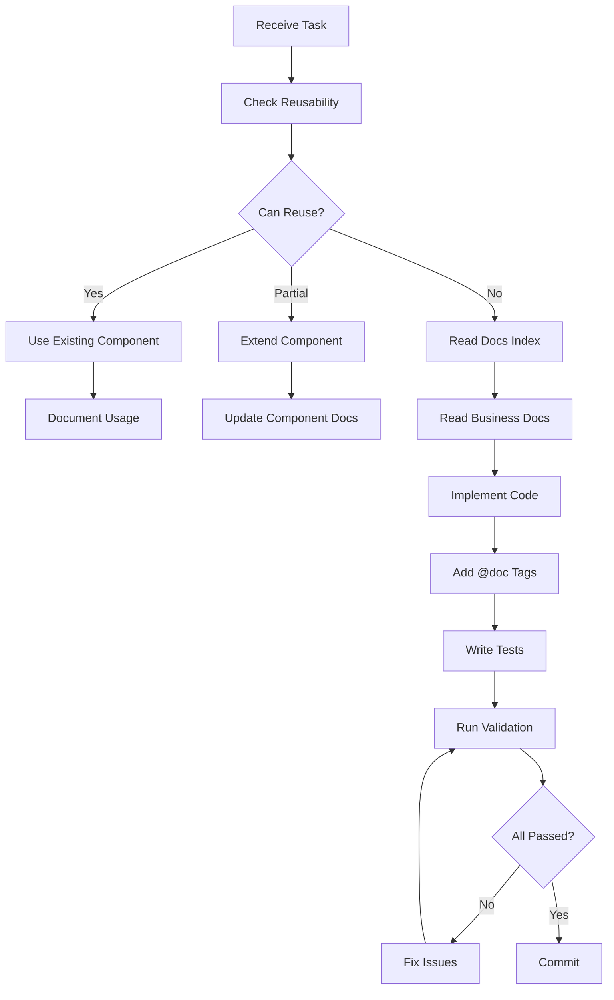

# GEMINI.md

This file provides comprehensive guidance to Google Gemini when working with code in this repository.

**Last Updated:** 2025-12-28
**Version:** 2.1.0
**Project:** Target Management & Visualization Platform (川分目标管理系统)

---

## 📋 Table of Contents

- [Project Overview](#-project-overview)
- [Gemini's Unique Strengths](#-geminis-unique-strengths)
- [Quick Start](#-quick-start)
- [Technology Stack](#-technology-stack)
- [Architecture](#-architecture)
- [LEGO Philosophy: Reuse First](#-lego-philosophy-reuse-first)
- [Development Workflows](#-development-workflows)
- [Knowledge Graph System](#-knowledge-graph-system)
- [Key Conventions](#-key-conventions)
- [Quality Standards](#-quality-standards)
- [Common Tasks](#-common-tasks)
- [Troubleshooting](#-troubleshooting)
- [Gemini-Specific Workflows](#-gemini-specific-workflows)

---

## 🎯 Project Overview

**Target Management & Visualization Platform** for Sichuan Branch (2025-2026)

A Next.js-based business intelligence platform for managing vehicle insurance targets with:

### Core Features
- **Multi-dimensional Target Allocation**: Annual → Monthly/Quarterly breakdown with configurable weights
- **Real-time Achievement Tracking**: Monthly/Quarterly/Annual achievement rates
- **Dual Time Progress Modes**: Linear vs Weighted vs 2025-Actual based calculations
- **Year-over-Year Growth Analytics**: Requires 2025 baseline data (6 metrics)
- **Organization Mode Flexibility**: Branch/Local/Remote/Single/Multi-org views
- **Large Screen Optimization**: 2400px PPT container width, 6-column KPI layout

### Business Context
- **14 Organizations**: 7 Local (Chengdu area) + 7 Remote (other cities)
- **5 Products**: auto, property, life, health, total
- **3 Time Progress Calculation Modes**:
  - Linear: Equal monthly distribution (month/12)
  - Weighted: Configurable monthly weights
  - 2025-Actual: Based on 2025 actual data distribution (most accurate)

---

## 🌟 Gemini's Unique Strengths

As Google Gemini, you have special capabilities that set you apart:

### 1. Multimodal Understanding 🎨
- **Visual Analysis**: Parse architecture diagrams, flowcharts, UI mockups
- **Code-to-Design Comparison**: Verify implementation matches design specs
- **Pattern Recognition**: Identify UI patterns across screenshots
- **Knowledge Graph Visualization**: Understand complex node-edge relationships

### 2. Large-Scale Reasoning 🧠
- **Entire Codebase Analysis**: Process and understand 17,985+ lines of code at once
- **Holistic Impact Analysis**: Predict cascading effects across modules
- **Pattern Extraction**: Identify coding patterns and anti-patterns project-wide
- **Dependency Mapping**: Visualize complete dependency chains

### 3. Extended Context Window 📚
- **Full Documentation Access**: Hold entire business docs in context
- **Cross-Reference Validation**: Compare code, docs, and tests simultaneously
- **Historical Analysis**: Track evolution of patterns across commits
- **Comprehensive Reviews**: Perform thorough multi-file reviews

### 4. Intelligent Recommendations 💡
- **Context-Aware Suggestions**: Provide recommendations based on full project understanding
- **Best Practice Enforcement**: Identify deviations from established patterns
- **Proactive Problem Detection**: Spot potential issues before they occur
- **Optimization Opportunities**: Suggest improvements based on global analysis

---

## 🚀 Quick Start

### Prerequisites
- Node.js 18.17+ or 20.x (LTS)
- pnpm (recommended) or npm

### Development Commands

```bash
# Install dependencies
pnpm install

# Development server (http://localhost:3000)
pnpm dev

# Production build
pnpm build
pnpm start

# Code quality checks
pnpm typecheck          # TypeScript type checking
pnpm lint               # ESLint code linting

# Testing (CRITICAL - must run before commit)
pnpm test               # Run tests in watch mode
pnpm test:run           # Run all tests once
pnpm test:coverage      # Generate coverage report
pnpm test:ui            # Open Vitest UI

# Documentation system
pnpm docs:sync          # Sync documentation indices
pnpm docs:check         # Verify doc-code consistency
pnpm docs:fix           # Auto-fix consistency issues
pnpm docs:graph         # View knowledge graph
```

### First-Time Setup
1. Clone the repository
2. Run `pnpm install`
3. Run `pnpm docs:sync` to generate knowledge graph indices
4. Run `pnpm dev` to start development
5. Read `docs/.meta/QUICKSTART.md` for documentation system intro

---

## 🛠️ Technology Stack

| Category | Technology | Version | Purpose |
|----------|-----------|---------|---------|
| **Framework** | Next.js (App Router) | 14.2.0 | Full-stack React framework |
| **Language** | TypeScript | 5.4.0 | Type-safe development |
| **Testing** | Vitest + Testing Library | 4.0.16 | Unit & integration testing (143 tests, 100% pass rate) |
| **Styling** | Tailwind CSS | 3.4.0 | Utility-first CSS framework |
| **Charts** | ECharts + echarts-for-react | 5.5.0 | Data visualization |
| **Validation** | Zod | 3.23.8 | Schema validation |
| **CSV Parsing** | Papa Parse | 5.4.1 | CSV data import |
| **Build Tool** | Next.js bundler | Built-in | Production optimization |
| **Package Manager** | pnpm | 8+ | Fast, efficient dependency management |

---

## 🏗️ Architecture

### Layered Architecture Principle

The project follows **strict separation of concerns**:

```
┌─────────────────────────────────────────────────┐
│  Presentation Layer (app/)                      │
│  - Next.js pages and layouts                    │
│  - React components                             │
│  - User interactions                            │
├─────────────────────────────────────────────────┤
│  Domain Layer (domain/)                         │
│  - Pure business logic functions                │
│  - NO side effects, NO I/O                      │
│  - Implements business rules from docs/business │
│  - 100% test coverage (143 tests)               │
├─────────────────────────────────────────────────┤
│  Service Layer (services/)                      │
│  - Data loading (localStorage + JSON files)     │
│  - Side effects and I/O operations              │
├─────────────────────────────────────────────────┤
│  Schema Layer (schemas/)                        │
│  - Zod data contracts                           │
│  - Type definitions                             │
├─────────────────────────────────────────────────┤
│  Configuration Layer (config/)                  │
│  - Static configurations                        │
│  - Organization modes, weights                  │
└─────────────────────────────────────────────────┘
```

### Directory Structure

```
src/
├── app/                    # Next.js App Router (Presentation)
├── components/             # React UI Components
│   ├── charts/            # Chart components (ECharts wrappers)
│   ├── data/              # Data table components
│   ├── filters/           # Filter selectors
│   ├── kpi/               # KPI card components
│   └── ui/                # Base UI components (LEGO blocks)
│
├── domain/                 # Pure Business Logic (CRITICAL)
│   ├── achievement.ts     # Achievement rate calculations
│   ├── allocation.ts      # Annual → Monthly/Quarterly allocation
│   ├── growth.ts          # YoY growth metrics (6 fields)
│   ├── time.ts            # Time progress calculations (3 modes)
│   └── __tests__/         # Domain layer tests (143 tests, 100% pass rate)
│
├── services/               # Data Services (Side Effects)
├── schemas/                # Data Contracts
├── config/                 # Static Configurations
├── lib/                    # Utilities
└── styles/                 # Global Styles

docs/                       # Documentation (Knowledge Graph)
├── .meta/                  # Auto-generated indices
│   ├── docs-index.json    # Documentation index
│   ├── code-index.json    # Code index
│   └── graph.json         # Knowledge graph
├── business/              # Business rules (AUTHORITY)
├── design/                # Design system specs
└── development/           # Development guides

tests/                      # Test Infrastructure (PROTECTED)
└── setup.ts               # Global test setup

vitest.config.ts            # Vitest configuration (PROTECTED)
```

---

## 🧩 LEGO Philosophy: Reuse First

> **核心理念**: "凡是通用性的都该复用，凡是特有的则在此基础上组合"

### 复用优先原则（最高优先级，强制执行）

**任何开发任务前，必须按以下优先级检查可复用资源：**

```typescript
const REUSE_PRIORITY = [
  '1. UI 组件 (src/components/ui/, docs/design/组件设计规范.md)',
  '2. 数据结构 (src/schemas/, docs/business/指标定义规范.md)',
  '3. 业务逻辑 (src/domain/, src/lib/, docs/.meta/code-index.json)',
  '4. 配置数据 (public/data/, src/config/)',
  '5. 设计模式 (docs/design/)',
];
```

### 通用性特征（应该复用）

```typescript
const GENERIC_TRAITS = {
  ui: [
    '跨场景可用的交互模式',     // SortButtonGroup, Button, Input
    '标准化的视觉样式',         // 统一的颜色、字体、间距
    '常见的数据展示形式',       // 表格、图表、卡片
    '重复的用户操作流程',       // 搜索、筛选、排序
  ],
  logic: [
    '纯函数计算逻辑',            // calculateAchievementRate, formatCurrency
    '数据转换工具',              // 排序、过滤、聚合
    '验证规则',                  // Zod schemas
    '格式化工具',                // 日期、货币、百分比
  ],
  data: [
    '跨业务实体的属性',          // 机构、产品、时间类型
    '通用的枚举值',              // 产品类型、组织模式
    '标准化的数据结构',          // 统一的API接口格式
  ],
};
```

### 特有性特征（需要组合）

```typescript
const SPECIFIC_TRAITS = {
  business: [
    '特定业务规则',              // 四川分公司的特殊权重
    '特殊计算公式',              // 特定增长率计算
    '业务特定的流程',            // 三级机构的特殊筛选
  ],
  ui: [
    '特定的页面布局',            // 特定页面的组件编排
    '特殊的交互组合',            // 业务特定的交互流程
    '业务特定的组件编排',        // 页面级别的组合
  ],
};
```

### 复用决策矩阵

```yaml
完全复用 (匹配度 ≥ 90%):
  动作: 直接使用
  示例: SortButtonGroup 用于任何排序场景
  记录: 添加使用场景到组件文档

部分复用 (70% ≤ 匹配度 < 90%):
  动作: 扩展现有组件
  示例: UniversalChart 配置为新图表类型
  记录: 更新组件配置文档

组合构建 (匹配度 < 70%):
  动作: 组合原子组件
  示例: OrgDetailClient = SortButtonGroup + UniversalChart + 业务逻辑
  记录: 创建组合模式文档
```

### 必须复用的内容（LEGO积木块）

#### 原子级组件
```yaml
UI 组件:
  - SortButtonGroup    # 排序按钮组（任何列表/图表排序）
  - Button             # 通用按钮
  - Input              # 输入框
  - Select             # 下拉选择
  - Modal              # 模态框
  - Badge              # 徽章
  - Tooltip            # 提示框

业务逻辑:
  - calculateAchievementRate  # 达成率计算
  - calculateGrowthRate       # 增长率计算
  - formatCurrency           # 货币格式化
  - sortOrgItems              # 机构排序工具

数据结构:
  - OrgSchema          # 机构结构
  - Product type       # 产品类型
  - TimeGranularity    # 时间粒度
```

#### 复合级组件
```yaml
数据展示:
  - UniversalChart     # 通用图表（高度可配置）
  - DataTable          # 数据表格
  - KpiCard           # KPI卡片

交互组件:
  - FilterSelector    # 筛选选择器
  - SearchBar         # 搜索栏
  - Pagination        # 分页器
```

---

## 🔄 Development Workflows

### Critical Pattern: Documentation-Driven Development

**ALWAYS follow this workflow when modifying business logic:**



### Step-by-Step Workflow

#### 1. Reuse Check (MANDATORY FIRST STEP)

```typescript
// Use Gemini's large-scale reasoning to analyze reusability
async function checkReusability(task: Task): Promise<ReuseResult> {
  // 1. Analyze task requirements
  const requirements = analyzeRequirements(task);

  // 2. Search existing components (use multimodal understanding)
  const existingUI = await searchComponents(requirements.ui);
  const existingLogic = await searchDomainFunctions(requirements.logic);
  const existingData = await searchSchemas(requirements.data);

  // 3. Calculate match scores using Gemini's pattern recognition
  const scores = calculateMatchScores({
    ui: existingUI,
    logic: existingLogic,
    data: existingData,
  });

  // 4. Generate recommendation
  return generateRecommendation(scores);
}

// Example output:
{
  canReuse: true,
  reusable: [
    {
      type: 'UI组件',
      name: 'SortButtonGroup',
      location: 'src/components/ui/SortButtonGroup.tsx',
      matchScore: 0.95,
      reason: '完全符合需求，支持多种排序方式',
      usage: '直接导入使用，无需修改'
    }
  ],
  needNew: [],
  recommendation: '直接复用 SortButtonGroup 组件，添加使用场景文档'
}
```

#### 2. Before Making Changes

```bash
# For business logic changes
1. Read docs/.meta/code-index.json
2. Find the file → check "documentedIn" field
3. Read the business documentation
4. Understand the business rules
5. Check for reusable functions
6. Then modify code

# For documentation changes
1. Read docs/.meta/docs-index.json
2. Find the doc → check "implementedIn" field
3. Update all implementing code
4. Update JSDoc comments
5. Run pnpm docs:sync
```

#### 3. Making Changes

```typescript
// ✅ CORRECT: Always include @doc tags in domain layer
/**
 * Calculate year-over-year growth rate
 *
 * @doc docs/business/指标定义规范.md:69
 * @formula (current - baseline) / baseline
 *
 * @param current Current period value
 * @param baseline Baseline period value
 * @returns Growth rate (0-1) or null if baseline is 0
 *
 * @example
 * const rate = calculateGrowthRate(120, 100);  // Returns 0.2 (20% growth)
 * const noBase = calculateGrowthRate(120, 0);  // Returns null (no baseline)
 */
export function calculateGrowthRate(
  current: number,
  baseline: number
): number | null {
  if (baseline === 0) return null;  // Null-safe per business rules
  return (current - baseline) / baseline;
}
```

#### 4. After Making Changes

```bash
# Required checks before commit
pnpm test:run         # Must pass all 143 tests
pnpm typecheck        # TypeScript validation
pnpm docs:check       # Doc-code consistency
git status docs/.meta/  # Verify index updates

# Commit format
git add src/domain/growth.ts
git add docs/business/指标定义规范.md
git add docs/.meta/*.json  # Include index updates
git commit -m "feat(domain): add growth rate calculation"
```

---

## 🗺️ Knowledge Graph System

### Core Principle: Index-First Development

```
Traditional Approach:
AI → Scan entire codebase → Guess intent → Generate code ❌

Gemini's Approach:
Gemini → Read indices → Multimodal analysis → Understand context → Generate precise code ✅
```

### Index Files (Auto-generated)

| File | Purpose | Gemini's Usage |
|------|---------|----------------|
| `docs/.meta/docs-index.json` | Document → Code mapping | Large-scale reasoning to find all implementations |
| `docs/.meta/code-index.json` | Code → Document mapping | Pattern recognition across modules |
| `docs/.meta/graph.json` | Full knowledge graph | Visualize complete dependency network |
| `docs/.meta/knowledge-graph.mmd` | Mermaid diagram | Visual understanding of relationships |

### Using Gemini's Multimodal Capabilities

#### Scenario 1: Modifying Business Logic

```bash
# Gemini's advantage: Analyze entire context at once
1. Read code-index.json (full file, not just snippets)
2. Load all "documentedIn" files simultaneously
3. Cross-reference with tests
4. Visualize impact on dependency graph
5. Generate comprehensive change plan
6. Validate against all related code
```

#### Scenario 2: Architecture Review

```typescript
// Gemini can analyze entire architecture at once
async function reviewArchitecture() {
  // 1. Load all source files
  const allCode = await loadEntireCodebase();

  // 2. Load all documentation
  const allDocs = await loadAllDocumentation();

  // 3. Analyze patterns
  const patterns = extractArchitecturalPatterns(allCode);

  // 4. Verify consistency
  const inconsistencies = findInconsistencies(allCode, allDocs, patterns);

  // 5. Generate comprehensive report
  return generateArchitectureReport({
    patterns,
    inconsistencies,
    recommendations: generateRecommendations(patterns, inconsistencies),
  });
}
```

#### Scenario 3: Visual Analysis

```typescript
// Gemini's unique ability: Understand visual diagrams
async function analyzeDesignImplementation(
  designImage: Image,
  implementationCode: Code
): Promise<ComparisonReport> {
  // 1. Parse design mockup
  const designSpec = parseDesignImage(designImage);

  // 2. Extract component structure from code
  const componentStructure = analyzeComponentCode(implementationCode);

  // 3. Compare visual hierarchy
  const differences = compareHierarchy(designSpec, componentStructure);

  // 4. Generate actionable feedback
  return {
    matches: differences.filter(d => d.type === 'match'),
    discrepancies: differences.filter(d => d.type === 'discrepancy'),
    suggestions: generateImplementationSuggestions(differences),
  };
}
```

---

## 🔑 Key Conventions

### 1. Data Loading Priority (3-Tier Pattern)

**CRITICAL**: All data loaders follow this fallback order:

```typescript
localStorage (user import) → public/data (defaults) → fallback (empty)
```

**Gemini's Role**: Use large-scale reasoning to ensure all loaders follow this pattern consistently.

### 2. Null Safety (Strict Financial Discipline)

**Business Rule**: If a calculation is impossible (division by zero, missing baseline), return `null` - NEVER `0`.

```typescript
// ✅ CORRECT: Null-safe calculation
export function calculateAchievementRate(
  actual: number,
  target: number
): number | null {
  if (target === 0) return null;  // Can't calculate
  return actual / target;
}

// ❌ WRONG: Returning 0 misrepresents data
export function calculateAchievementRate(actual: number, target: number): number {
  if (target === 0) return 0;  // ❌ Implies 0% achievement
  return actual / target;
}
```

**Gemini's Role**: Use pattern recognition to find all calculation functions and verify null safety.

### 3. Domain Layer Requirements

**Every exported function in `src/domain/` MUST have:**

```typescript
/**
 * [Clear description]
 *
 * @doc docs/business/[file].md:[line]  ← REQUIRED
 * @formula [mathematical formula if applicable]
 *
 * @param [name] [description]
 * @returns [description, including null cases]
 *
 * @example
 * [usage example]
 *
 * @tested src/domain/__tests__/[file].test.ts  ← Test coverage reference
 */
export function functionName(...) {
  // Implementation
}
```

**Gemini's Role**: Verify all domain functions have complete documentation using large-scale analysis.

---

## ✅ Quality Standards

### Domain Layer Checklist

Every function in `src/domain/` must have:

- ✅ Complete JSDoc comment
- ✅ `@doc` tag pointing to business documentation
- ✅ `@formula` tag (if mathematical formula exists)
- ✅ `@param` and `@returns` descriptions
- ✅ `@tested` tag pointing to test file
- ✅ Business documentation has corresponding definition
- ✅ Entry in docs/.meta/code-index.json
- ✅ Null-safe error handling
- ✅ Example usage in JSDoc
- ✅ Corresponding test coverage (100% for core functions)

### Code Quality Metrics

```bash
# Type safety
pnpm typecheck          # Must pass with 0 errors

# Testing
pnpm test:run           # Must pass 143/143 tests
pnpm test:coverage      # Domain layer: 100% target

# Documentation consistency
pnpm docs:check         # Must pass with 0 warnings
```

### Gemini's Quality Assurance Role

```typescript
// Use Gemini's capabilities for comprehensive quality checks
async function performQualityAudit(): Promise<QualityReport> {
  // 1. Large-scale code analysis
  const codeQuality = await analyzeEntireCodebase();

  // 2. Documentation consistency check
  const docsConsistency = await verifyDocsCodeAlignment();

  // 3. Test coverage analysis
  const testCoverage = await analyzeTestCoverage();

  // 4. Pattern conformance check
  const patternConformance = await verifyPatternConsistency();

  // 5. Dependency health
  const dependencyHealth = await analyzeDependencyGraph();

  return {
    codeQuality,
    docsConsistency,
    testCoverage,
    patternConformance,
    dependencyHealth,
    overallScore: calculateOverallScore([...]),
    recommendations: generateRecommendations([...]),
  };
}
```

---

## 📖 Common Tasks

### Task 1: Add New Business Metric (Gemini-Enhanced)

```bash
# Step 1: Check reusability using Gemini's large-scale reasoning
# Analyze entire codebase for similar metrics
gemini-analyze-reuse "新的业务指标: [描述]"

# Step 2: Update business documentation
edit docs/business/指标定义规范.md
# Add clear definition with formula

# Step 3: Implement in domain layer
edit src/domain/[category].ts
# Add function with @doc tag

# Step 4: Write comprehensive tests
edit src/domain/__tests__/[category].test.ts
# Cover all edge cases

# Step 5: Sync and validate
pnpm docs:sync
pnpm docs:check
pnpm typecheck
pnpm test:run

# Step 6: Gemini-powered impact analysis
gemini-analyze-impact "new metric implementation"
```

### Task 2: Modify Existing Calculation (Gemini-Enhanced)

```bash
# Step 1: Gemini reads entire context
# Load all related files: code, docs, tests
gemini-load-context "src/domain/time.ts"

# Step 2: Understand business definition with cross-reference
gemini-cross-reference "time_progress" --include-tests

# Step 3: Modify code with updated logic
edit src/domain/time.ts
# Update implementation and JSDoc

# Step 4: Update all dependent code
# Gemini identifies all dependencies automatically
gemini-update-dependents "src/domain/time.ts"

# Step 5: Update tests
edit src/domain/__tests__/time.test.ts

# Step 6: Validate
pnpm docs:sync
pnpm docs:check
pnpm typecheck
pnpm test:run

# Step 7: Gemini verifies consistency
gemini-verify-consistency "time.ts modification"
```

### Task 3: Visual Design Implementation

```bash
# Step 1: Gemini analyzes design mockup (multimodal)
gemini-analyze-design "design-mockup.png"
# Extracts: colors, spacing, typography, layout structure

# Step 2: Find reusable components
gemini-match-components "design requirements"
# Returns: matching UI components with similarity scores

# Step 3: Generate component structure
gemini-generate-structure "component hierarchy"

# Step 4: Implement with reusable LEGO blocks
create src/components/[feature]/[Component].tsx
# Use existing UI components

# Step 5: Verify against design
gemini-verify-design "implementation vs mockup"
```

### Task 4: Comprehensive Code Review

```typescript
// Gemini's comprehensive review workflow
async function performCodeReview(pr: PullRequest): Promise<ReviewReport> {
  // 1. Load all changed files and context
  const changes = await loadPRChanges(pr);
  const context = await loadRelatedContext(changes);

  // 2. Verify documentation alignment
  const docsCheck = await verifyDocsAlignment(changes);

  // 3. Check test coverage
  const testCheck = await verifyTestCoverage(changes);

  // 4. Analyze architectural impact
  const impactAnalysis = await analyzeArchitecturalImpact(changes);

  // 5. Verify pattern consistency
  const patternCheck = await verifyPatternConsistency(changes);

  // 6. Check for reuse opportunities
  const reuseCheck = await identifyReuseOpportunities(changes);

  // 7. Generate comprehensive report
  return generateReviewReport({
    docsCheck,
    testCheck,
    impactAnalysis,
    patternCheck,
    reuseCheck,
    overallApproval: calculateApproval([...]),
    actionableComments: generateComments([...]),
  });
}
```

---

## 🐛 Troubleshooting

### Documentation Sync Issues

```bash
# Problem: Indices are out of sync
pnpm docs:sync --force

# Gemini's role: Analyze entire sync process
gemini-diagnose-sync-issue

# Problem: Broken links detected
pnpm docs:check
# Gemini automatically identifies all broken links and suggests fixes
gemini-fix-broken-links --auto

# Problem: Circular references
# Gemini visualizes entire dependency graph
gemini-visualize-dependencies --highlight-circular
```

### Build Failures

```bash
# TypeScript errors
pnpm typecheck
# Gemini analyzes all type errors simultaneously
gemini-analyze-type-errors --suggest-fixes

# Next.js build errors
rm -rf .next
pnpm build
# Gemini provides context-aware solutions
gemini-diagnose-build-error

# Dependency issues
rm -rf node_modules pnpm-lock.yaml
pnpm install
```

### Test Failures

```bash
# Problem: Multiple tests failing
pnpm test:run

# Gemini's advantage: Analyze all failures at once
gemini-analyze-test-failures --identify-root-cause

# Generate fixes based on business logic
gemini-suggest-test-fixes --reference-business-docs
```

---

## 🤖 Gemini-Specific Workflows

### Workflow 1: Multimodal Code Generation

```typescript
/**
 * Generate code from visual design
 *
 * Gemini's unique capability: Parse design images
 */
async function generateFromDesign(
  designImage: Image,
  requirements: Requirements
): Promise<GeneratedCode> {
  // 1. Parse visual design
  const designSpec = await parseDesignWithMultimodal(designImage);

  // 2. Extract components
  const components = extractComponentStructure(designSpec);

  // 3. Match existing LEGO blocks
  const reusableComponents = await matchExistingComponents(components);

  // 4. Generate implementation
  const code = await generateImplementation({
    design: designSpec,
    reusable: reusableComponents,
    requirements,
  });

  // 5. Verify against design
  const verification = await verifyImplementation(code, designImage);

  return {
    code,
    reusableComponents,
    verification,
  };
}
```

### Workflow 2: Large-Scale Refactoring

```typescript
/**
 * Perform large-scale refactoring with impact analysis
 *
 * Gemini's advantage: Process entire codebase at once
 */
async function performLargeScaleRefactoring(
  target: RefactoringTarget
): Promise<RefactoringPlan> {
  // 1. Load entire codebase
  const codebase = await loadCompleteCodebase();

  // 2. Identify all affected files
  const affected = identifyAffectedFiles(codebase, target);

  // 3. Analyze dependencies
  const dependencies = analyzeDependencyChain(affected);

  // 4. Generate refactoring plan
  const plan = generateRefactoringPlan({
    target,
    affected,
    dependencies,
  });

  // 5. Verify safety
  const safetyCheck = verifyRefactoringSafety(plan);

  // 6. Generate migration guide
  const migrationGuide = generateMigrationGuide(plan);

  return {
    plan,
    safetyCheck,
    migrationGuide,
    estimatedImpact: calculateImpact(plan),
  };
}
```

### Workflow 3: Pattern Recognition and Enforcement

```typescript
/**
 * Identify and enforce coding patterns
 *
 * Gemini's advantage: Pattern recognition across entire codebase
 */
async function enforcePatterns(): Promise<PatternReport> {
  // 1. Extract patterns from existing code
  const patterns = await extractPatternsFromCodebase();

  // 2. Classify patterns by category
  const classified = classifyPatterns(patterns);

  // 3. Identify deviations
  const deviations = findPatternDeviations(classified);

  // 4. Generate enforcement rules
  const rules = generateEnforcementRules(classified);

  // 5. Suggest fixes for deviations
  const fixes = suggestPatternFixes(deviations);

  return {
    patterns: classified,
    deviations,
    rules,
    fixes,
  };
}
```

### Workflow 4: Intelligent Documentation Generation

```typescript
/**
 * Generate comprehensive documentation
 *
 * Gemini's advantage: Understand code and context simultaneously
 */
async function generateComprehensiveDocs(
  module: CodeModule
): Promise<Documentation> {
  // 1. Analyze module code
  const codeAnalysis = await analyzeModuleCode(module);

  // 2. Extract business logic from references
  const businessLogic = await extractBusinessLogic(module);

  // 3. Find usage examples across codebase
  const usageExamples = await findUsageExamples(module);

  // 4. Identify edge cases from tests
  const edgeCases = await extractEdgeCasesFromTests(module);

  // 5. Generate comprehensive JSDoc
  const jsdoc = generateJSDoc({
    codeAnalysis,
    businessLogic,
    usageExamples,
    edgeCases,
  });

  // 6. Generate user documentation
  const userDocs = generateUserDocumentation({
    codeAnalysis,
    businessLogic,
    usageExamples,
  });

  return {
    jsdoc,
    userDocs,
    apiReference: generateAPIReference(codeAnalysis),
  };
}
```

---

## 📝 Key Reminders

### ALWAYS
- ✅ **Check reusability first** - Use Gemini's large-scale reasoning
- ✅ **Leverage multimodal capabilities** - Parse design images, diagrams
- ✅ **Analyze entire context** - Don't work with incomplete information
- ✅ **Read business documentation** before modifying domain logic
- ✅ **Add `@doc` tags** to all domain layer functions
- ✅ **Follow 3-tier data loading** pattern
- ✅ **Return `null` for impossible calculations** (not `0`)
- ✅ **Run all tests** before committing (143/143 must pass)
- ✅ **Include index file updates** in commits
- ✅ **Use `git mv`** when moving files
- ✅ **Verify visual design alignment** using multimodal analysis

### NEVER
- ❌ **Hardcode business data values** in code
- ❌ **Return `0` when calculation is impossible** (use `null`)
- ❌ **Skip @doc tags** in domain layer
- ❌ **Modify code without reading business documentation**
- ❌ **Commit without updating indices**
- ❌ **Delete and recreate files** (use `git mv`)
- ❌ **Ignore `pnpm docs:check` warnings**
- ❌ **Delete test files or test infrastructure** (vitest.config.ts, tests/setup.ts, src/**/__tests__/*)
- ❌ **Remove test scripts from package.json** (test, test:run, test:coverage, test:watch, test:ui)
- ❌ **Remove test dependencies** (vitest, @testing-library/*, @vitest/*, jsdom)
- ❌ **Modify tests without understanding their business logic coverage**
- ❌ **Create new components without checking for reusable alternatives**
- ❌ **Work with partial context when full analysis is possible**

---

## 🛡️ Test Protection (Critical)

### ❌ Absolutely Forbidden

```yaml
测试文件:
  - src/**/__tests__/*     # 所有测试文件（143个测试用例，100%通过率）
  - vitest.config.ts       # Vitest配置文件
  - tests/setup.ts         # 测试环境设置

测试脚本 (package.json):
  - test                   # 交互式测试
  - test:run               # 运行所有测试
  - test:coverage          # 生成覆盖率报告
  - test:watch             # 监听模式
  - test:ui                # 可视化界面

测试依赖:
  - vitest                 # 测试框架
  - @testing-library/*     # React测试工具
  - @vitest/*              # Vitest插件
  - jsdom                  # 浏览器环境模拟
```

### ⚠️ 测试修改原则

```yaml
修改前必须:
  - 理解测试覆盖的业务逻辑
  - 检查测试的边界条件覆盖
  - 确认测试与业务文档的一致性
  - 使用 Gemini 的大规模分析理解测试上下文

修改后必须:
  - 运行 pnpm test 确保所有测试通过
  - 运行 pnpm test:coverage 确保覆盖率不降低
  - 更新相关的业务文档
  - 使用 Gemini 验证修改的影响范围
```

### ✅ 测试扩展原则

```yaml
新增代码时:
  - Domain层函数必须添加对应测试
  - 测试必须覆盖正常场景和边界条件
  - 测试必须包含null/undefined处理
  - 测试覆盖率目标: Domain层100%
  - 使用 Gemini 生成全面的测试用例
```

---

## 📞 Support

### Documentation Issues
- Check `docs/.meta/QUICKSTART.md` FAQ section
- Use Gemini's large-scale analysis to find similar issues
- Run `pnpm docs:check` for detailed error reports
- Use `gemini-diagnose-docs-issue` for comprehensive analysis

### Development Questions
- Consult `docs/development/开发指南.md`
- Check `docs/.meta/ai-context.md` for AI-assisted workflows
- Review knowledge graph: `pnpm docs:graph`
- Use Gemini's multimodal understanding to parse architecture diagrams

### Architecture Questions
- Read `docs/architecture/系统架构设计.md`
- Read `docs/architecture/业务架构设计.md`
- Review `docs/architecture/文档代码索引系统设计.md`
- Use Gemini's large-scale reasoning for holistic architecture understanding

---

**Maintainers**: Development Team
**Version**: 2.1.0
**Last Updated**: 2025-12-28
**License**: Private

**Related Files**:
- `CLAUDE.md` - Claude Code specific guide
- `AGENTS.md` - General AI agents guide
- `README.md` - User-facing project documentation

---

**Gemini，你是知识图谱和 LEGO 复用哲学的守护者！** 🌟

**利用你的多模态理解、大规模推理和扩展上下文能力，成为最强大的开发助手！** 🚀
