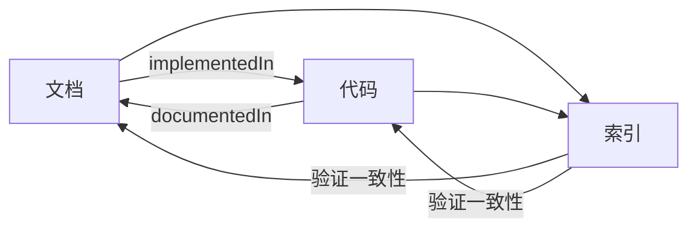
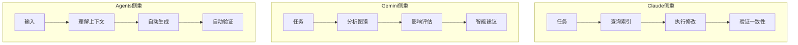

# AI 工具指令文件对比指南

> 如何在 CLAUDE.md、GEMINI.md、AGENTS.md 中体现知识图谱思路

## 📋 三个文件的区别

| 特性 | CLAUDE.md | GEMINI.md | AGENTS.md |
|------|-----------|-----------|-----------|
| **目标用户** | Claude Code | Google Gemini | 其他AI工具 |
| **核心能力** | 交互式开发 | 大规模推理 | 代码补全 |
| **上下文窗口** | 200K tokens | 1M+ tokens | 变化较大 |
| **多模态** | 部分支持 | ✅ 强大 | 有限 |
| **工作流程** | 5步工作流 | 4阶段分析 | 3阶段生成 |
| **重点场景** | 任务执行 | 影响分析 | 自动补全 |

---

## 🎯 知识图谱思路的体现

### 共同点：索引优先

所有三个文件都强调：
```
传统方式：
AI → 扫描代码 → 猜测意图 → 生成代码

索引方式（知识图谱）：
AI → 读取索引 → 理解上下文 → 精准生成
       ↓
    docs/.meta/
    ├── code-index.json    # 代码索引
    ├── docs-index.json    # 文档索引
    └── graph.json         # 知识图谱
```

### 差异点：侧重不同

#### CLAUDE.md 侧重：**执行流程**
```yaml
Step 1: 任务分析（必须）
  - 分析任务类型
  - 查询知识图谱
  - 识别关联文档和代码

Step 2: 上下文收集（关键）
  - 基于索引收集相关文件
  - 理解业务上下文

Step 3: 执行修改（规范）
  - 文档驱动开发
  - 先更新文档 → 再写代码

Step 4: 提交前检查（强制）
  - pnpm typecheck
  - pnpm docs:check
  - 验证索引完整性

Step 5: 沟通输出（清晰）
  - 说明变更
  - 列出影响
```

**体现方式**：
- 详细的5步工作流
- 实战示例（2025实际口径）
- 质量保障清单
- 常见错误与修正

#### GEMINI.md 侧重：**智能分析**
```yaml
Gemini 专属能力：
  - 多模态理解（图表、架构图）
  - 大规模推理（分析整个图谱）
  - 代码与文档对比（找出不一致）
  - 影响分析（预测连锁反应）

智能查询工作流：
  场景1: 理解新概念
    → 查询索引 → 定位文档 → 理解定义

  场景2: 代码审查
    → 读取索引 → 检查一致性 → 生成报告

  场景3: 影响分析
    → 分析图谱 → 找出依赖 → 评估风险
```

**体现方式**：
- 4个专属技能（多模态、大规模推理等）
- 4个专属命令（知识图谱分析、影响分析等）
- 强调Gemini的大上下文优势
- 图谱分析健康报告

#### AGENTS.md 侧重：**自动化集成**
```yaml
通用 Agent 工作流：

阶段1: 上下文理解
  function understandContext(task) {
    const codeIndex = readJson('code-index.json');
    const docsIndex = readJson('docs-index.json');
    return analyzeContext(codeIndex, docsIndex);
  }

阶段2: 代码生成
  function generateCode(context) {
    const patterns = extractPatterns(context);
    const rules = extractBusinessRules(context);
    return generate(patterns, rules);
  }

阶段3: 自动验证
  function validate(code) {
    return {
      typeCheck: runTypeCheck(),
      docsCheck: runDocsCheck(),
      indexCheck: verifyIndex()
    };
  }
```

**体现方式**：
- 标准化的3阶段工作流
- 代码示例（TypeScript函数）
- 集成指南（配置步骤）
- 适配多种AI工具（Copilot/Cursor等）

---

## 🔍 知识图谱思路的三个维度

### 维度1：**双向追溯**（所有文件都强调）



**CLAUDE.md 体现**：
```markdown
## 场景1: 修改业务逻辑
1. 读取 code-index.json
2. 查找 "documentedIn" 字段
3. 阅读对应的业务文档
4. 理解业务逻辑后再修改
```

**GEMINI.md 体现**：
```markdown
## 场景2: 代码审查
你的审查清单：
1. 读取 code-index["file"].documentedIn
2. 检查对应的文档是否也更新
3. 验证每个依赖是否需要更新
```

**AGENTS.md 体现**：
```typescript
// 索引文件结构示例
{
  "modules": {
    "src/domain/time.ts": {
      "documentedIn": ["docs/business/指标定义规范.md:26-64"],
      "usedBy": ["src/app/page.tsx:7-15"]
    }
  }
}
```

### 维度2：**知识图谱导航**（不同文件侧重不同）



**CLAUDE.md 体现**：
- 重点：**执行路径清晰**
- 工具：5步工作流 + 质量检查清单
- 示例：完整的"2025实际口径"实现过程

**GEMINI.md 体现**：
- 重点：**全局视角分析**
- 工具：知识图谱健康报告 + 影响分析
- 示例：一次性分析整个项目的依赖关系

**AGENTS.md 体现**：
- 重点：**自动化流程**
- 工具：标准化接口 + 集成指南
- 示例：自动补全、重构建议、测试生成

### 维度3：**一致性保障**（三种验证方式）

| 文件 | 验证方式 | 触发时机 | 验证内容 |
|------|---------|---------|---------|
| **CLAUDE.md** | 手动+自动 | 提交前 | TypeScript + 文档 + 索引 |
| **GEMINI.md** | 智能分析 | 审查时 | 语义一致性 + 影响范围 |
| **AGENTS.md** | 自动集成 | 生成后 | 类型 + 文档 + 测试 |

**CLAUDE.md 体现**：
```bash
### Step 4: 提交前检查（强制）
pnpm typecheck  # TypeScript检查
pnpm docs:check # 文档一致性
git status docs/.meta/  # 索引更新
```

**GEMINI.md 体现**：
```typescript
## 质量检查清单
每次协助开发时，你需要确认：
- [ ] 文档定义与代码实现一致
- [ ] 公式在文档和代码中相同
- [ ] 参数说明匹配
- [ ] 影响范围已评估
```

**AGENTS.md 体现**：
```typescript
function validate(code: Code): ValidationResult {
  return {
    typeCheck: runTypeCheck(),
    docsCheck: runDocsCheck(),
    indexCheck: verifyIndex(),
    passed: allPassed(...)
  };
}
```

---

## 📖 使用指南

### 情况1: 使用 Claude Code
→ 阅读 `CLAUDE.md` 和 `docs/.meta/ai-context.md`

**特点**：
- 交互式开发，边聊边改
- 需要清晰的工作流程指导
- 强调质量检查和一致性验证

**使用场景**：
- 实现新功能
- 重构代码
- 修复bug
- 更新文档

### 情况2: 使用 Google Gemini
→ 阅读 `GEMINI.md` 和 `docs/.meta/graph.json`

**特点**：
- 大上下文，可以分析整个项目
- 多模态，可以理解图表
- 强大的推理能力

**使用场景**：
- 项目架构分析
- 影响范围评估
- 代码审查
- 重构建议
- 健康度检查

### 情况3: 使用其他 AI 工具
→ 阅读 `AGENTS.md` 和 `docs/.meta/index-schema.md`

**特点**：
- 代码补全为主
- 需要标准化的接口
- 强调自动化

**使用场景**：
- 自动补全
- 代码生成
- 重构建议
- 测试生成

---

## 🎯 核心思想：三个文件的统一

尽管三个文件针对不同的AI工具，但它们都遵循同一个核心思想：

### 核心思想：知识图谱驱动的开发

```
┌─────────────────────────────────────┐
│         知识图谱系统                  │
│                                     │
│  docs/.meta/                        │
│  ├── code-index.json  ◄───┐        │
│  ├── docs-index.json  ◄───┼─ 索引  │
│  └── graph.json       ◄───┘        │
│                                     │
└─────────────────────────────────────┘
              │
              ▼
    ┌─────────────────────┐
    │   AI 工具访问层      │
    │                     │
    │ CLAUDE.md  执行流程 │
    │ GEMINI.md  智能分析 │
    │ AGENTS.md  自动化   │
    │                     │
    └─────────────────────┘
              │
              ▼
    ┌─────────────────────┐
    │   开发者体验层       │
    │                     │
    │ - 精准的代码生成    │
    │ - 智能的重构建议    │
    │ - 自动的一致性检查  │
    │ - 完整的影响分析    │
    │                     │
    └─────────────────────┘
```

### 统一的价值主张

无论使用哪个AI工具，都能获得：

1. **更精准的生成**
   - 基于项目实际的业务定义
   - 符合项目代码风格
   - 包含完整的文档注释

2. **更智能的建议**
   - 理解业务上下文
   - 评估影响范围
   - 提供最佳实践

3. **更可靠的质量**
   - 自动一致性检查
   - 强制文档覆盖
   - 索引实时更新

---

## 🚀 快速开始

### Step 1: 选择你的AI工具
```bash
# Claude Code 用户
cat CLAUDE.md

# Google Gemini 用户
cat GEMINI.md

# 其他AI工具用户
cat AGENTS.md
```

### Step 2: 生成首次索引
```bash
pnpm docs:sync
```

### Step 3: 查看知识图谱
```bash
pnpm docs:graph
```

### Step 4: 开始使用
```bash
# Claude Code
# 在对话中提到："参考 CLAUDE.md 中的工作流程"

# Google Gemini
# 在提示词中包含："读取 docs/.meta/graph.json 分析项目"

# 其他 AI 工具
# 配置上下文文件指向 docs/.meta/
```

---

## 📚 深入学习

### 理解知识图谱系统
1. `docs/.meta/README.md` - 系统总览
2. `docs/.meta/ai-context.md` - 完整的AI工具指南
3. `docs/architecture/文档代码索引系统设计.md` - 深入设计

### 实战练习
1. 阅读 `CLAUDE.md` 的"实战示例"
2. 尝试用 Gemini 分析项目健康度
3. 配置你的 AI 工具使用索引

### 贡献改进
1. 发现问题提 Issue
2. 改进文档提 PR
3. 分享使用心得

---

## 💡 最佳实践

### 实践1: 为你的AI选择合适的文件
- ✅ Claude Code → CLAUDE.md（详细工作流）
- ✅ Google Gemini → GEMINI.md（大规模分析）
- ✅ GitHub Copilot → AGENTS.md（自动化）

### 实践2: 始终从索引开始
```typescript
// ❌ 不好
直接问AI："帮我写一个函数"

// ✅ 好
问AI："先读取 code-index.json，理解现有模式，
      然后根据 docs/business/指标定义规范.md
      生成符合规范的函数"
```

### 实践3: 持续更新索引
```bash
# 每次修改代码后
pnpm docs:sync

# 每次提交前
pnpm docs:check
```

---

## 🎉 总结

三个文件（CLAUDE.md、GEMINI.md、AGENTS.md）都体现了同一个核心思想：

> **让AI工具通过知识图谱理解项目，而不是盲目猜测**

它们的区别在于：
- **CLAUDE.md** 注重**执行流程**
- **GEMINI.md** 注重**智能分析**
- **AGENTS.md** 注重**自动化集成**

但核心都是：
1. 📖 **索引优先** - 先查询知识图谱
2. 🔗 **双向追溯** - 文档↔代码互相引用
3. ✅ **一致性保障** - 自动验证同步

选择适合你的AI工具，然后开始享受知识图谱带来的开发体验提升吧！ 🚀

---

**让知识图谱成为AI的眼睛，让AI真正理解你的项目！** 🌟
