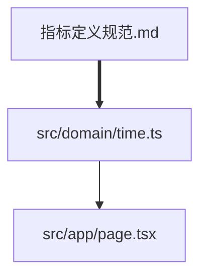

# AI工具上下文指南

本文件为AI辅助工具（Claude Code、GitHub Copilot等）提供项目结构和更新规则。

## 🎯 核心原则

**文档驱动开发（Documentation-Driven Development）**：
1. 设计变更 → 先更新文档 → 再更新代码
2. 代码实现 → 同步更新文档 → 验证一致性
3. 文件移动 → 更新所有引用 → 验证链接

## 📚 知识图谱结构

### 文档层次
```
docs/
├── business/           # 业务规则（最高优先级）
│   ├── 指标定义规范.md  → 定义所有业务指标
│   └── 目标分配规则.md  → 定义分配算法
├── architecture/       # 架构设计
├── design/            # UI/UX设计
├── development/       # 开发指南
└── .meta/             # 元数据索引
    ├── docs-index.json
    ├── code-index.json
    └── graph.json
```

### 代码层次
```
src/
├── domain/            # 纯业务逻辑（实现 docs/business/）
│   ├── time.ts       ← 实现"时间进度"定义
│   ├── achievement.ts ← 实现"达成率"定义
│   └── growth.ts     ← 实现"增长率"定义
├── app/              # UI展示层（实现 docs/design/）
├── services/         # 数据服务层
└── schemas/          # 数据契约层
```

## 🔄 自动同步规则

### 规则1: 业务指标变更同步
```yaml
触发条件: docs/business/指标定义规范.md 修改
同步动作:
  1. 扫描新增/修改的指标定义
  2. 检查 src/domain/ 中是否有对应实现
  3. 如果缺失，生成实现骨架
  4. 更新 docs/.meta/code-index.json

示例:
  文档新增: time_progress_actual2025_year
  → 自动生成: src/domain/time.ts:actual2025ProgressYear()
  → 更新文档: 添加函数引用链接
```

### 规则2: 代码函数变更同步
```yaml
触发条件: src/domain/*.ts 新增/修改导出函数
同步动作:
  1. 提取函数签名和JSDoc
  2. 查找 @doc 标记的文档位置
  3. 验证文档中是否描述该函数
  4. 如果缺失，提示补充文档

示例:
  代码新增: export function actual2025ProgressQuarter()
  → 检查: @doc docs/business/指标定义规范.md:36
  → 验证: 文档第36行是否定义了该函数
  → 若缺失: 生成文档模板插入
```

### 规则3: 文档结构变更同步
```yaml
触发条件: docs/**/*.md 文件移动/重命名
同步动作:
  1. 扫描所有文档中的交叉引用
  2. 更新所有链接到旧路径的引用
  3. 扫描代码中的 @doc 标记
  4. 更新指向该文档的代码注释

示例:
  文件移动: docs/business/指标定义.md → docs/business/指标定义规范.md
  → 更新: 所有 [xxx](docs/business/指标定义.md) 链接
  → 更新: 所有 @doc docs/business/指标定义.md 注释
```

## 🤖 AI工具使用指南

### 当你要修改业务逻辑时

```markdown
步骤:
1. 先读取 docs/business/指标定义规范.md
2. 理解相关业务规则的定义
3. 修改 src/domain/*.ts 中的实现
4. 在函数JSDoc中添加 @doc 标记指向文档
5. 运行 `tsx scripts/sync-docs-code.ts` 验证同步

示例代码:
/**
 * 年度2025实际进度
 * @doc docs/business/指标定义规范.md:31
 * @formula sum(actuals2025[0..month-1]) / sum(actuals2025[0..11])
 */
export function actual2025ProgressYear(...)
```

### 当你要更新业务定义时

```markdown
步骤:
1. 修改 docs/business/指标定义规范.md
2. 添加清晰的公式和说明
3. 运行 `tsx scripts/sync-docs-code.ts`
4. 查看报告，确认哪些代码需要更新
5. 实现缺失的函数
6. 再次运行同步脚本验证

文档格式:
- **time_progress_actual2025_year** <!--impl:src/domain/time.ts:62-75-->
  年度2025实际进度 = sum(2025实际[1..当前月份]) / sum(2025实际[1..12])
```

### 当你要重构文件结构时

```markdown
步骤:
1. 使用 Git 移动文件（保留历史）
2. 运行 `tsx scripts/sync-docs-code.ts --update-refs`
3. 检查生成的引用更新报告
4. 提交所有变更（包括 .meta/ 文件）

注意事项:
- 不要手动删除+创建，使用 git mv
- 先更新索引，再修改内容
- 移动多个文件时，一次性完成后再同步
```

## 📋 变更检查清单

### 添加新业务指标时
- [ ] 在 `docs/business/指标定义规范.md` 中定义
- [ ] 包含公式、参数说明、示例
- [ ] 在 `src/domain/` 中实现对应函数
- [ ] 函数添加 `@doc` JSDoc标记
- [ ] 在 `src/schemas/schema.ts` 中添加类型定义（如需要）
- [ ] 在 `src/app/page.tsx` 中集成到UI（如需要）
- [ ] 运行 `tsx scripts/sync-docs-code.ts` 验证
- [ ] 运行 `pnpm typecheck` 和 `pnpm build`

### 修改现有指标定义时
- [ ] 更新 `docs/business/指标定义规范.md`
- [ ] 查找所有实现该指标的函数（通过索引）
- [ ] 更新所有相关函数的实现
- [ ] 更新函数的JSDoc注释
- [ ] 运行测试（如有）
- [ ] 运行同步脚本验证一致性
- [ ] 检查UI显示是否需要调整

### 重命名/移动文件时
- [ ] 使用 `git mv` 移动文件
- [ ] 运行 `tsx scripts/sync-docs-code.ts --update-refs`
- [ ] 检查生成的更新报告
- [ ] 手动验证关键引用
- [ ] 提交所有变更（代码+文档+索引）

## 🔍 快速查询命令

```bash
# 查找某个概念在哪里定义
grep -r "time_progress_actual2025" docs/

# 查找某个函数的文档位置
grep -A5 "@doc" src/domain/time.ts

# 查看知识图谱
code docs/.meta/knowledge-graph.mmd

# 检查文档-代码一致性
tsx scripts/sync-docs-code.ts

# 查看某个文档被哪些代码引用
jq '.modules[] | select(.documentedIn[] | contains("指标定义规范"))' \
   docs/.meta/code-index.json
```

## 🎨 Mermaid图谱说明

知识图谱使用Mermaid格式，可在VS Code中预览：



图例：
- `[]` 方框 = 文档节点
- `()` 圆框 = 代码节点
- `==>` 粗箭头 = 定义关系（文档定义代码）
- `-->` 细箭头 = 使用关系（代码使用代码）

## 🚨 常见问题处理

### Q1: 索引文件过期怎么办？
```bash
# 强制重新生成索引
tsx scripts/sync-docs-code.ts --force
```

### Q2: 如何忽略某些文件？
编辑 `docs/.meta/sync-rules.yaml`:
```yaml
ignore:
  docs:
    - "**/archive/**"
    - "**/drafts/**"
  code:
    - "**/*.test.ts"
    - "**/*.stories.tsx"
```

### Q3: 如何处理循环引用？
索引工具会检测循环引用并报警，需要手动重构：
```
⚠️ 检测到循环引用:
docs/A.md → docs/B.md → docs/A.md
建议: 提取共同部分到 docs/C.md
```

## 📊 质量指标

索引系统会跟踪以下指标：

- **文档覆盖率**: 有文档说明的代码模块比例
- **链接完整性**: 有效链接占总链接的比例
- **同步延迟**: 代码变更后文档更新的平均时间
- **孤立节点**: 没有任何链接的文档/代码数量

目标:
- 文档覆盖率 > 80%（domain层100%）
- 链接完整性 > 95%
- 同步延迟 < 24小时
- 孤立节点 < 5%
