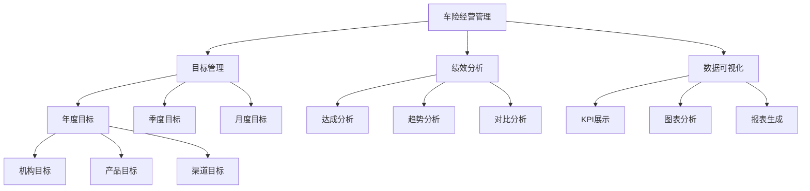
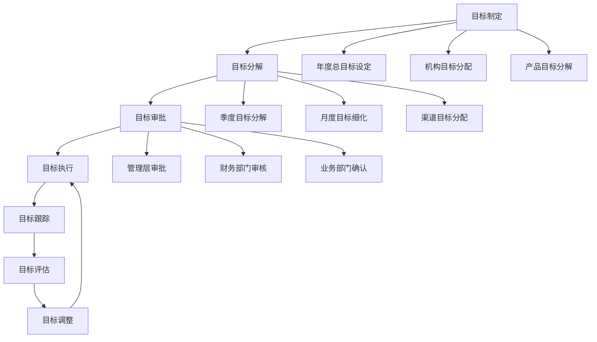
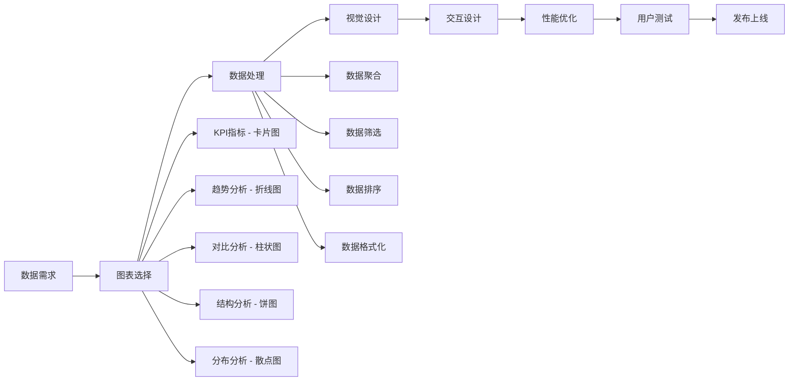

# 💼 业务架构设计

> 川分目标管理系统的业务逻辑架构与领域模型  
**版本:** 2.0.0  
**更新时间:** 2025-12-23  
**业务领域**: 车险经营目标管理

---

## 📑 业务概览

- [领域模型](#-领域模型)
- [业务流程](#-业务流程)
- [数据模型](#-数据模型)
- [服务架构](#-服务架构)
- [业务规则](#-业务规则)

---

## 🏢 领域模型

### 📊 核心业务领域



### 🎯 业务实体模型

```typescript
// 核心业务实体
interface BusinessDomain {
  // 机构实体
  Organization: {
    id: string;
    code: string;
    name: string;
    level: 'province' | 'city' | 'branch';
    parentId?: string;
    children?: Organization[];
  };
  
  // 产品实体
  Product: {
    id: string;
    code: string;
    name: string;
    category: 'auto' | 'property' | 'accident' | 'other';
    subCategory?: string;
  };
  
  // 目标实体
  Target: {
    id: string;
    organizationId: string;
    productId: string;
    year: number;
    quarter?: number;
    month?: number;
    type: 'premium' | 'policy' | 'profit';
    value: number;
    unit: 'yuan' | 'count' | 'rate';
    status: 'draft' | 'approved' | 'active' | 'completed';
  };
  
  // 业绩实体
  Achievement: {
    id: string;
    targetId: string;
    organizationId: string;
    productId: string;
    period: string; // YYYY-MM格式
    actualValue: number;
    plannedValue: number;
    achievementRate: number;
    status: 'preliminary' | 'final' | 'adjusted';
  };
}
```

### 📊 业务关系模型

```typescript
// 业务关系定义
interface BusinessRelationships {
  // 机构层级关系
  organizationHierarchy: {
    type: 'tree';
    rootLevel: 'province';
    maxDepth: 3;
    aggregationRules: {
      premium: 'sum';
      policy: 'sum';
      rate: 'weighted_average';
    };
  };
  
  // 时间维度关系
  timeDimensions: {
    year: {
      quarters: [1, 2, 3, 4];
      months: [1, 2, 3, 4, 5, 6, 7, 8, 9, 10, 11, 12];
    };
    aggregationRules: {
      quarterly: 'sum_of_months';
      annual: 'sum_of_quarters';
    };
  };
  
  // 产品组合关系
  productCombinations: {
    primary: ['auto', 'property'];
    secondary: ['accident', 'other'];
    bundlingRules: {
      crossSell: 'enable';
      upsell: 'enable';
      package: 'optional';
    };
  };
}
```

---

## 🔄 业务流程

### 📊 目标管理流程



### 🎯 绩效分析流程

```typescript
// 绩效分析业务流程
interface PerformanceAnalysisFlow {
  // 数据收集阶段
  dataCollection: {
    sources: [
      'core_system',      // 核心业务系统
      'financial_system', // 财务系统
      'crm_system',      // 客户关系系统
      'external_data'     // 外部数据源
    ];
    frequency: 'daily';
    validation: 'automatic';
  };
  
  // 数据处理阶段
  dataProcessing: {
    cleansing: 'remove_duplicates_and_errors';
    transformation: 'standardize_units_and_formats';
    enrichment: 'add_calculated_fields';
    aggregation: 'summarize_by_dimensions';
  };
  
  // 分析计算阶段
  analysisCalculation: {
    basicMetrics: [
      'premium_income',
      'policy_count', 
      'profit_margin',
      'loss_ratio'
    ];
    derivedMetrics: [
      'achievement_rate',
      'growth_rate',
      'market_share',
      'efficiency_ratio'
    ];
    comparisons: [
      'period_comparison',
      'organization_comparison',
      'product_comparison'
    ];
  };
  
  // 结果输出阶段
  resultOutput: {
    dashboards: 'real_time_visualization';
    reports: 'scheduled_generation';
    alerts: 'threshold_based_notifications';
    exports: 'multiple_formats';
  };
}
```

### 📈 数据可视化流程



---

## 📊 数据模型

### 🎯 核心数据模型

```typescript
// 目标数据模型
interface TargetModel {
  // 基础属性
  id: string;                    // 唯一标识
  name: string;                  // 目标名称
  description?: string;          // 目标描述
  
  // 关联属性
  organizationId: string;        // 所属机构
  productId: string;             // 所属产品
  dimensionId?: string;          // 分析维度
  
  // 时间属性
  year: number;                  // 年度
  quarter?: number;              // 季度
  month?: number;                // 月份
  startDate: Date;               // 开始日期
  endDate: Date;                 // 结束日期
  
  // 目标属性
  type: TargetType;              // 目标类型
  value: number;                 // 目标值
  unit: TargetUnit;              // 计量单位
  baselineValue?: number;        // 基准值
  stretchValue?: number;         // 挑战值
  
  // 状态属性
  status: TargetStatus;          // 目标状态
  priority: TargetPriority;      // 优先级
  category: TargetCategory;      // 目标类别
  
  // 审计属性
  createdBy: string;             // 创建人
  createdAt: Date;               // 创建时间
  updatedBy?: string;            // 更新人
  updatedAt?: Date;               // 更新时间
  approvedBy?: string;           // 审批人
  approvedAt?: Date;             // 审批时间
}

// 目标类型枚举
enum TargetType {
  PREMIUM = 'premium',           // 保费目标
  POLICY = 'policy',             // 保单目标
  PROFIT = 'profit',             // 利润目标
  GROWTH = 'growth',             // 增长目标
  EFFICIENCY = 'efficiency'      // 效率目标
}

// 目标单位枚举
enum TargetUnit {
  YUAN = 'yuan',                 // 元
  TEN_THOUSAND_YUAN = 'ten_thousand_yuan',  // 万元
  MILLION_YUAN = 'million_yuan', // 百万元
  COUNT = 'count',               // 数量
  RATE = 'rate',                 // 比率
  PERCENT = 'percent'            // 百分比
}
```

### 📊 业绩数据模型

```typescript
// 业绩数据模型
interface AchievementModel {
  // 基础属性
  id: string;                    // 唯一标识
  targetId: string;              // 关联目标
  organizationId: string;        // 所属机构
  productId: string;             // 所属产品
  
  // 时间属性
  period: string;                // 统计周期 YYYY-MM
  year: number;                  // 年度
  quarter?: number;              // 季度
  month?: number;                // 月份
  reportDate: Date;              // 报告日期
  
  // 业绩属性
  actualValue: number;           // 实际值
  plannedValue: number;          // 计划值
  variance: number;               // 差异值
  achievementRate: number;        // 达成率
  
  // 状态属性
  status: AchievementStatus;     // 业绩状态
  confidence: ConfidenceLevel;   // 数据置信度
  quality: DataQuality;          // 数据质量
  
  // 详细分解
  breakdowns?: {                 // 明细分解
    channel?: AchievementBreakdown;     // 渠道分解
    product?: AchievementBreakdown;      // 产品分解
    region?: AchievementBreakdown;       // 区域分解
  };
  
  // 审计属性
  dataSource: string;            // 数据来源
  verifiedBy?: string;           // 验证人
  verifiedAt?: Date;             // 验证时间
  comments?: string;             // 备注说明
}

// 业绩分解数据
interface AchievementBreakdown {
  dimension: string;             // 维度名称
  items: Array<{
    key: string;                 // 维度值
    actualValue: number;         // 实际值
    plannedValue: number;        // 计划值
    achievementRate: number;    // 达成率
  }>;
}
```

---

## 🛠️ 服务架构

### 📊 业务服务层

```typescript
// 业务服务接口定义
interface BusinessServices {
  // 目标管理服务
  targetService: {
    // 目标CRUD操作
    createTarget(request: CreateTargetRequest): Promise<Target>;
    updateTarget(id: string, request: UpdateTargetRequest): Promise<Target>;
    deleteTarget(id: string): Promise<void>;
    getTarget(id: string): Promise<Target>;
    
    // 目标查询操作
    listTargets(filters: TargetFilters): Promise<PaginatedResponse<Target>>;
    searchTargets(query: string): Promise<Target[]>;
    
    // 目标业务操作
    approveTarget(id: string, request: ApproveTargetRequest): Promise<Target>;
    activateTarget(id: string): Promise<Target>;
    deactivateTarget(id: string): Promise<Target>;
    
    // 目标分析操作
    analyzeTargets(filters: AnalysisFilters): Promise<TargetAnalysis>;
    compareTargets(request: CompareTargetsRequest): Promise<TargetComparison>;
  };
  
  // 业绩管理服务
  achievementService: {
    // 业绩CRUD操作
    createAchievement(request: CreateAchievementRequest): Promise<Achievement>;
    updateAchievement(id: string, request: UpdateAchievementRequest): Promise<Achievement>;
    deleteAchievement(id: string): Promise<void>;
    getAchievement(id: string): Promise<Achievement>;
    
    // 业绩查询操作
    listAchievements(filters: AchievementFilters): Promise<PaginatedResponse<Achievement>>;
    searchAchievements(query: string): Promise<Achievement[]>;
    
    // 业绩分析操作
    analyzeAchievements(filters: AnalysisFilters): Promise<AchievementAnalysis>;
    calculateAchievementRate(request: AchievementRateRequest): Promise<AchievementRate>;
    
    // 业绩报表操作
    generateAchievementReport(request: ReportRequest): Promise<Report>;
    exportAchievements(request: ExportRequest): Promise<ExportResult>;
  };
  
  // 分析服务
  analysisService: {
    // 趋势分析
    analyzeTrend(request: TrendAnalysisRequest): Promise<TrendAnalysis>;
    
    // 对比分析
    comparePerformance(request: ComparisonRequest): Promise<ComparisonResult>;
    
    // 预测分析
    forecastPerformance(request: ForecastRequest): Promise<ForecastResult>;
    
    // 异常检测
    detectAnomalies(request: AnomalyDetectionRequest): Promise<AnomalyResult>;
  };
}
```

### 🎯 领域服务实现

```typescript
// 目标管理服务实现
class TargetService implements TargetServiceInterface {
  constructor(
    private targetRepository: TargetRepository,
    private organizationRepository: OrganizationRepository,
    private eventBus: EventBus,
    private logger: Logger
  ) {}
  
  /**
   * 创建目标
   * 业务规则验证、数据校验、事件发布
   */
  async createTarget(request: CreateTargetRequest): Promise<Target> {
    // 1. 业务规则验证
    await this.validateCreateTargetRules(request);
    
    // 2. 数据转换
    const target = this.mapToTarget(request);
    
    // 3. 持久化
    const createdTarget = await this.targetRepository.create(target);
    
    // 4. 发布事件
    await this.eventBus.publish(new TargetCreatedEvent(createdTarget));
    
    // 5. 记录日志
    this.logger.info('Target created', { targetId: createdTarget.id });
    
    return createdTarget;
  }
  
  /**
   * 目标审批
   * 权限验证、状态变更、通知发送
   */
  async approveTarget(id: string, request: ApproveTargetRequest): Promise<Target> {
    // 1. 获取目标
    const target = await this.targetRepository.findById(id);
    if (!target) {
      throw new TargetNotFoundError(id);
    }
    
    // 2. 权限验证
    await this.validateApprovalPermission(request.approverId);
    
    // 3. 状态变更
    target.status = TargetStatus.APPROVED;
    target.approvedBy = request.approverId;
    target.approvedAt = new Date();
    target.comments = request.comments;
    
    // 4. 持久化
    const approvedTarget = await this.targetRepository.update(target);
    
    // 5. 发布事件
    await this.eventBus.publish(new TargetApprovedEvent(approvedTarget));
    
    // 6. 发送通知
    await this.notificationService.sendApprovalNotification(approvedTarget);
    
    return approvedTarget;
  }
  
  /**
   * 目标分析
   * 数据聚合、指标计算、结果返回
   */
  async analyzeTargets(filters: AnalysisFilters): Promise<TargetAnalysis> {
    // 1. 数据查询
    const targets = await this.targetRepository.findByFilters(filters);
    
    // 2. 数据聚合
    const aggregatedData = this.aggregateTargets(targets, filters.dimensions);
    
    // 3. 指标计算
    const metrics = this.calculateMetrics(aggregatedData);
    
    // 4. 趋势分析
    const trends = this.analyzeTrends(aggregatedData, filters.timeRange);
    
    // 5. 构建分析结果
    return {
      summary: this.buildSummary(metrics),
      details: aggregatedData,
      trends,
      insights: this.generateInsights(metrics, trends)
    };
  }
  
  private async validateCreateTargetRules(request: CreateTargetRequest): Promise<void> {
    // 验证机构存在性
    const organization = await this.organizationRepository.findById(request.organizationId);
    if (!organization) {
      throw new OrganizationNotFoundError(request.organizationId);
    }
    
    // 验证目标值合理性
    if (request.value <= 0) {
      throw new InvalidTargetValueError('Target value must be positive');
    }
    
    // 验证时间范围合理性
    if (request.startDate >= request.endDate) {
      throw new InvalidTimeRangeError('Start date must be before end date');
    }
    
    // 验证重复目标
    const existingTarget = await this.targetRepository.findByUniqueKey(
      request.organizationId,
      request.productId,
      request.year,
      request.quarter,
      request.month
    );
    
    if (existingTarget) {
      throw new DuplicateTargetError('Target already exists for the given criteria');
    }
  }
}
```

---

## 📋 业务规则

### 🎯 目标管理规则

```typescript
// 业务规则引擎
interface BusinessRules {
  // 目标创建规则
  targetCreation: {
    // 规则1: 目标值必须为正数
    positiveValue: {
      condition: (target: Target) => target.value > 0;
      errorMessage: '目标值必须大于0';
      severity: 'error';
    };
    
    // 规则2: 年度目标必须在财年内
    fiscalYear: {
      condition: (target: Target) => {
        const fiscalStart = new Date(target.year, 3, 1); // 4月1日
        const fiscalEnd = new Date(target.year + 1, 2, 31); // 次年3月31日
        return target.startDate >= fiscalStart && target.endDate <= fiscalEnd;
      };
      errorMessage: '目标时间必须在财年范围内';
      severity: 'error';
    };
    
    // 规则3: 子目标总和不能超过父目标
    targetHierarchy: {
      condition: async (target: Target, repository: TargetRepository) => {
        if (target.quarter || target.month) return true; // 非顶层目标
        
        const childTargets = await repository.findByParentId(target.id);
        const childSum = childTargets.reduce((sum, child) => sum + child.value, 0);
        return childSum <= target.value;
      };
      errorMessage: '子目标总和不能超过父目标';
      severity: 'warning';
    };
  };
  
  // 业绩验证规则
  achievementValidation: {
    // 规则1: 达成率不能超过150%
    maxAchievementRate: {
      condition: (achievement: Achievement) => achievement.achievementRate <= 1.5;
      errorMessage: '达成率不能超过150%';
      severity: 'warning';
    };
    
    // 规则2: 负增长需要说明
    negativeGrowth: {
      condition: (achievement: Achievement) => {
        return achievement.actualValue >= achievement.plannedValue * 0.5;
      };
      errorMessage: '实际值过低，需要说明原因';
      severity: 'info';
    };
  };
  
  // 数据质量规则
  dataQuality: {
    // 规则1: 数据完整性检查
    completeness: {
      condition: (data: any) => {
        const requiredFields = ['actualValue', 'plannedValue', 'period'];
        return requiredFields.every(field => data[field] != null);
      };
      errorMessage: '缺少必要字段';
      severity: 'error';
    };
    
    // 规则2: 数据一致性检查
    consistency: {
      condition: (achievement: Achievement, target: Target) => {
        return achievement.organizationId === target.organizationId &&
               achievement.productId === target.productId;
      };
      errorMessage: '业绩数据与目标数据不一致';
      severity: 'error';
    };
  };
}
```

### 📊 数据聚合规则

```typescript
// 数据聚合规则定义
interface AggregationRules {
  // 时间维度聚合
  timeAggregation: {
    // 月度聚合到季度
    monthToQuarter: {
      source: 'monthly_data';
      target: 'quarterly_data';
      method: 'sum';
      condition: 'same_year_and_quarter';
    };
    
    // 季度聚合到年度
    quarterToYear: {
      source: 'quarterly_data';
      target: 'yearly_data';
      method: 'sum';
      condition: 'same_year';
    };
  };
  
  // 组织维度聚合
  organizationAggregation: {
    // 下级机构聚合到上级机构
    childrenToParent: {
      source: 'branch_data';
      target: 'city_data';
      method: 'sum';
      condition: 'direct_parent_child';
    };
    
    // 城市聚合到省份
    cityToProvince: {
      source: 'city_data';
      target: 'province_data';
      method: 'sum';
      condition: 'same_province';
    };
  };
  
  // 产品维度聚合
  productAggregation: {
    // 子产品聚合到主产品
    subToMain: {
      source: 'sub_product_data';
      target: 'main_product_data';
      method: 'sum';
      condition: 'same_main_category';
    };
    
    // 产品聚合到品类
    productToCategory: {
      source: 'product_data';
      target: 'category_data';
      method: 'sum';
      condition: 'same_category';
    };
  };
  
  // 比率指标聚合
  ratioAggregation: {
    // 达成率聚合
    achievementRate: {
      numerator: 'sum_of_actual_values';
      denominator: 'sum_of_planned_values';
      formula: 'numerator / denominator';
      unit: 'percentage';
    };
    
    // 增长率聚合
    growthRate: {
      numerator: 'current_period_value';
      denominator: 'previous_period_value';
      formula: '(numerator - denominator) / denominator';
      unit: 'percentage';
    };
  };
}
```

---

**文档版本:** 2.0.0  
**更新时间:** 2025-12-23  
**维护团队**: 业务架构团队  
**相关文档**: [系统架构设计](./系统架构设计.md) | [数据架构设计](./数据架构设计.md)