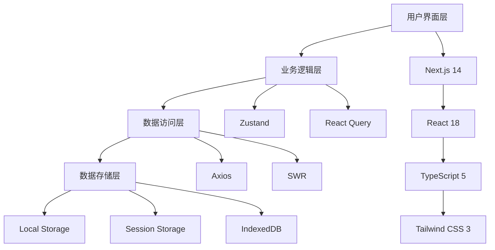
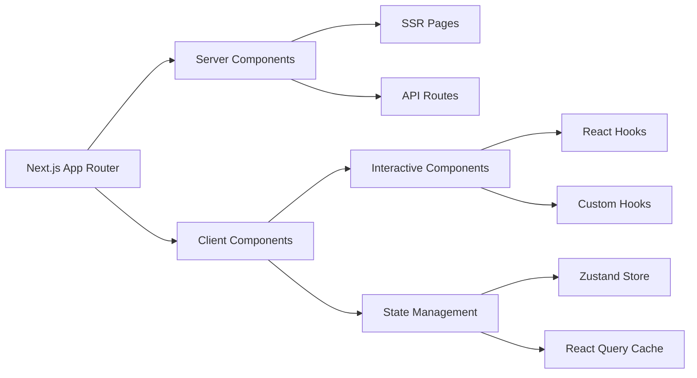
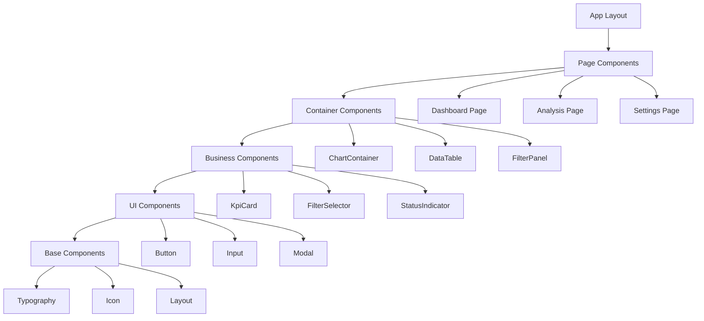
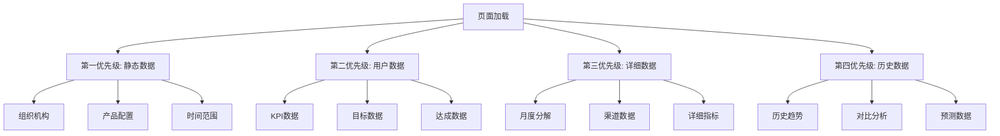
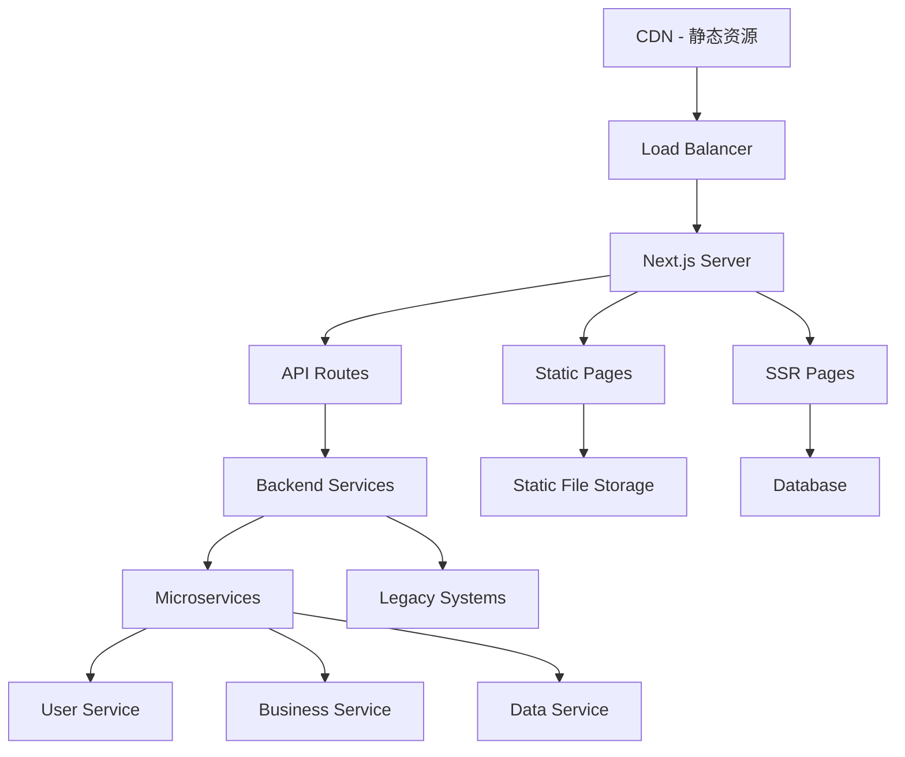
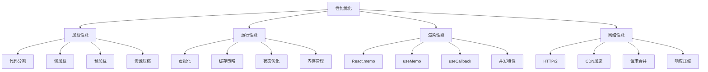

# 🏗️ 系统架构设计

> 川分目标管理系统的整体技术架构与设计原则  
**版本:** 2.0.0  
**更新时间:** 2025-12-23  
**技术栈:** Next.js 14 + TypeScript 5 + Tailwind CSS 3 + ECharts

---

## 📑 架构概览

- [架构设计原则](#-架构设计原则)
- [技术栈架构](#-技术栈架构)
- [数据流架构](#-数据流架构)
- [组件架构](#-组件架构)
- [部署架构](#-部署架构)
- [性能架构](#-性能架构)

---

## 🎯 架构设计原则

### 1. 单一职责原则
- **模块化**: 每个模块只负责一个特定的业务功能
- **组件化**: UI组件具有明确的职责边界
- **服务化**: 数据获取和业务逻辑分离为独立服务

### 2. 开放封闭原则
- **扩展性**: 通过配置和插件机制支持功能扩展
- **稳定性**: 核心接口保持稳定，避免破坏性变更
- **版本兼容**: 向后兼容的API设计

### 3. 依赖倒置原则
- **抽象依赖**: 高层模块不依赖低层模块，都依赖抽象
- **接口隔离**: 使用TypeScript接口定义契约
- **依赖注入**: 通过依赖注入管理组件关系

---

## 🛠️ 技术栈架构

### 📊 整体技术栈



### 🎨 前端框架架构



### 🎯 组件层次架构



---

## 🔄 数据流架构

### 📊 数据加载优先级



### 🎯 状态管理架构

```typescript
// 全局状态结构
interface GlobalState {
  // 用户状态
  user: {
    profile: UserProfile;
    permissions: Permission[];
    preferences: UserPreferences;
  };
  
  // 业务状态
  business: {
    organization: OrganizationState;
    product: ProductState;
    timeRange: TimeRangeState;
    targets: TargetState;
    achievements: AchievementState;
  };
  
  // UI状态
  ui: {
    theme: ThemeState;
    layout: LayoutState;
    filters: FilterState;
    loading: LoadingState;
    errors: ErrorState;
  };
  
  // 缓存状态
  cache: {
    charts: ChartCache;
    tables: TableCache;
    metadata: MetadataCache;
  };
}

// Zustand Store 结构
const useGlobalStore = create<GlobalState>((set, get) => ({
  // 状态定义
  user: initialUserState,
  business: initialBusinessState,
  ui: initialUIState,
  cache: initialCacheState,
  
  // Action 定义
  actions: {
    updateUser: (user: Partial<UserState>) => set((state) => ({
      user: { ...state.user, ...user }
    })),
    
    updateOrganization: (org: Organization) => set((state) => ({
      business: { ...state.business, organization: org }
    })),
    
    setFilter: (filter: FilterConfig) => set((state) => ({
      ui: { ...state.ui, filters: { ...state.ui.filters, ...filter } }
    })),
    
    clearCache: () => set((state) => ({
      cache: initialCacheState
    }))
  }
}));
```

### 🔄 数据流模式

```typescript
// 数据获取流程
interface DataFlow {
  // 1. 组件触发数据请求
  trigger: () => Promise<void>;
  
  // 2. 缓存检查
  checkCache: (key: string) => boolean;
  
  // 3. API调用
  fetchFromAPI: (endpoint: string) => Promise<any>;
  
  // 4. 数据转换
  transform: (raw: any) => ProcessedData;
  
  // 5. 状态更新
  updateState: (data: ProcessedData) => void;
  
  // 6. 缓存更新
  updateCache: (key: string, data: ProcessedData) => void;
}

// 实现示例
const useDataFlow = (endpoint: string, params: any) => {
  const { actions } = useGlobalStore();
  
  return useQuery({
    queryKey: [endpoint, params],
    queryFn: async () => {
      // 检查缓存
      const cacheKey = `${endpoint}_${JSON.stringify(params)}`;
      if (checkCache(cacheKey)) {
        return getFromCache(cacheKey);
      }
      
      // API调用
      const response = await fetchFromAPI(endpoint, params);
      
      // 数据转换
      const transformed = transform(response);
      
      // 更新缓存
      updateCache(cacheKey, transformed);
      
      return transformed;
    },
    staleTime: 5 * 60 * 1000, // 5分钟
    cacheTime: 10 * 60 * 1000, // 10分钟
  });
};
```

---

## 🧩 组件架构

### 📊 组件分类体系

```typescript
// 组件类型定义
interface ComponentArchitecture {
  // 页面组件 - 路由级别
  pages: {
    Dashboard: DashboardPage;
    Analysis: AnalysisPage;
    Settings: SettingsPage;
  };
  
  // 容器组件 - 布局和业务逻辑
  containers: {
    ChartContainer: ChartContainerComponent;
    DataTable: DataTableComponent;
    FilterPanel: FilterPanelComponent;
  };
  
  // 业务组件 - 特定业务功能
  business: {
    KpiCard: KpiCardComponent;
    FilterSelector: FilterSelectorComponent;
    StatusIndicator: StatusIndicatorComponent;
  };
  
  // UI组件 - 通用界面元素
  ui: {
    Button: ButtonComponent;
    Input: InputComponent;
    Modal: ModalComponent;
  };
  
  // 基础组件 - 最小功能单元
  base: {
    Typography: TypographyComponent;
    Icon: IconComponent;
    Layout: LayoutComponent;
  };
}
```

### 🎯 组件通信模式

```typescript
// 1. Props 传递 - 父子组件通信
interface ParentChildCommunication {
  // 父组件向子组件传递数据
  parentToChild: {
    props: ComponentProps;
    children: React.ReactNode;
    renderProps: (data: any) => React.ReactNode;
  };
  
  // 子组件向父组件传递事件
  childToParent: {
    callbacks: EventCallbacks;
    eventEmitters: CustomEvents;
  };
}

// 2. Context 传递 - 跨层级通信
interface ContextCommunication {
  themeContext: ThemeContext;
  userContext: UserContext;
  businessContext: BusinessContext;
  uiContext: UIContext;
}

// 3. 状态管理 - 全局状态通信
interface StateManagementCommunication {
  zustand: GlobalStore;
  reactQuery: QueryCache;
  localState: ComponentState;
}

// 4. 事件总线 - 组件间解耦通信
interface EventBusCommunication {
  customEvents: CustomEventTarget;
  messageChannel: MessageChannel;
  broadcastChannel: BroadcastChannel;
}
```

---

## 🚀 部署架构

### 📊 应用部署架构



### 🎯 环境架构

```typescript
// 环境配置
interface EnvironmentConfig {
  development: {
    apiUrl: 'http://localhost:3000/api';
    enableHotReload: true;
    enableMockData: true;
    logLevel: 'debug';
  };
  
  staging: {
    apiUrl: 'https://staging-api.example.com';
    enableHotReload: false;
    enableMockData: false;
    logLevel: 'info';
  };
  
  production: {
    apiUrl: 'https://api.example.com';
    enableHotReload: false;
    enableMockData: false;
    logLevel: 'error';
  };
}

// 构建配置
interface BuildConfig {
  // 静态资源优化
  optimization: {
    minification: true;
    compression: true;
    treeShaking: true;
    codeSplitting: true;
  };
  
  // 性能配置
  performance: {
    bundleAnalysis: true;
    bundleSizeLimit: '1MB';
    chunkSizeLimit: '250KB';
  };
  
  // 缓存策略
  caching: {
    staticAssets: '1year';
    apiResponses: '5minutes';
    pages: '1hour';
  };
}
```

---

## ⚡ 性能架构

### 📊 性能优化策略



### 🎯 性能监控架构

```typescript
// 性能监控系统
interface PerformanceMonitoring {
  // 核心性能指标
  coreMetrics: {
    FCP: number;      // First Contentful Paint
    LCP: number;      // Largest Contentful Paint
    FID: number;      // First Input Delay
    CLS: number;      // Cumulative Layout Shift
    TTI: number;      // Time to Interactive
  };
  
  // 自定义业务指标
  businessMetrics: {
    dataLoadTime: number;
    chartRenderTime: number;
    filterResponseTime: number;
    userInteractionLatency: number;
  };
  
  // 监控配置
  monitoring: {
    sampleRate: number;    // 采样率
    endpoint: string;      // 上报端点
    batchSize: number;     // 批量大小
    flushInterval: number; // 刷新间隔
  };
}

// 性能监控实现
class PerformanceMonitor {
  private metrics: PerformanceMonitoring['coreMetrics'] = {
    FCP: 0,
    LCP: 0,
    FID: 0,
    CLS: 0,
    TTI: 0
  };
  
  // 监控页面加载性能
  observePagePerformance() {
    // 使用 PerformanceObserver API
    const observer = new PerformanceObserver((list) => {
      for (const entry of list.getEntries()) {
        switch (entry.entryType) {
          case 'paint':
            if (entry.name === 'first-contentful-paint') {
              this.metrics.FCP = entry.startTime;
            }
            break;
          case 'largest-contentful-paint':
            this.metrics.LCP = entry.startTime;
            break;
          case 'first-input':
            this.metrics.FID = entry.processingStart - entry.startTime;
            break;
          case 'layout-shift':
            this.metrics.CLS += entry.value;
            break;
        }
      }
    });
    
    observer.observe({ entryTypes: ['paint', 'largest-contentful-paint', 'first-input', 'layout-shift'] });
  }
  
  // 上报性能数据
  reportMetrics() {
    fetch('/api/performance', {
      method: 'POST',
      headers: { 'Content-Type': 'application/json' },
      body: JSON.stringify({
        metrics: this.metrics,
        url: window.location.href,
        userAgent: navigator.userAgent,
        timestamp: Date.now()
      })
    });
  }
}
```

---

## 🔧 开发工具架构

### 📊 开发工具链

```typescript
// 开发工具配置
interface DevelopmentTools {
  // 代码质量
  codeQuality: {
    eslint: ESLintConfig;
    prettier: PrettierConfig;
    typescript: TypeScriptConfig;
    husky: HuskyConfig;
    lintStaged: LintStagedConfig;
  };
  
  // 测试工具
  testing: {
    jest: JestConfig;
    testingLibrary: TestingLibraryConfig;
    cypress: CypressConfig;
    storybook: StorybookConfig;
  };
  
  // 构建工具
  buildTools: {
    nextjs: NextJSConfig;
    webpack: WebpackConfig;
    postcss: PostCSSConfig;
    tailwind: TailwindConfig;
  };
  
  // 开发体验
  developerExperience: {
    hotReload: boolean;
    errorOverlay: boolean;
    fastRefresh: boolean;
    sourceMaps: boolean;
  };
}
```

### 🎯 代码规范架构

```typescript
// 代码规范定义
interface CodeStandards {
  // 命名规范
  naming: {
    components: 'PascalCase';
    functions: 'camelCase';
    variables: 'camelCase';
    constants: 'UPPER_SNAKE_CASE';
    files: 'kebab-case';
  };
  
  // 文件组织规范
  fileOrganization: {
    components: 'feature-based';
    utils: 'utility-based';
    types: 'domain-based';
    hooks: 'functionality-based';
  };
  
  // 注释规范
  documentation: {
    functions: 'JSDoc';
    components: 'ComponentDoc';
    interfaces: 'TypeDoc';
    examples: 'CodeExamples';
  };
  
  // Git规范
  gitConventions: {
    commits: 'ConventionalCommits';
    branches: 'GitFlow';
    releases: 'SemanticVersioning';
  };
}
```

---

## 📚 架构决策记录 (ADR)

### 🎯 ADR-001: 选择Next.js作为框架

**状态**: 已接受  
**日期**: 2025-12-23

**背景**: 需要选择一个适合企业级应用的前端框架

**决策**: 选择Next.js 14作为主要前端框架

**原因**:
1. **SSR/SSG支持**: 提供服务端渲染和静态站点生成，提升首屏加载性能
2. **文件路由**: 基于文件的路由系统，简化路由配置
3. **API Routes**: 内置API路由，支持全栈开发
4. **性能优化**: 自动代码分割、图片优化、字体优化
5. **生态系统**: 丰富的插件和工具支持

**后果**:
- 需要学习Next.js特有的API和约定
- 部署方式与传统SPA不同
- 开发体验更好，但学习成本略高

### 🎯 ADR-002: 状态管理策略

**状态**: 已接受  
**日期**: 2025-12-23

**背景**: 需要选择适合的状态管理方案

**决策**: 采用Zustand + React Query的混合状态管理策略

**原因**:
1. **Zustand**: 轻量级、TypeScript友好、API简洁
2. **React Query**: 专注服务器状态管理，提供缓存、重试等特性
3. **职责分离**: 客户端状态用Zustand，服务器状态用React Query
4. **性能**: 两者都具有优秀的性能表现

### 🎯 ADR-003: 样式方案选择

**状态**: 已接受  
**日期**: 2025-12-23

**背景**: 需要确定UI样式实现方案

**决策**: 采用Tailwind CSS + 自定义设计系统的方案

**原因**:
1. **设计一致性**: 通过自定义配置确保设计系统一致性
2. **开发效率**: 原子化CSS提升开发效率
3. **包体积**: 生产环境只包含使用的样式
4. **维护性**: 样式与组件结构分离，易于维护

---

**文档版本:** 2.0.0  
**更新时间:** 2025-12-23  
**维护团队**: 架构团队  
**相关文档**: [业务架构设计](./业务架构设计.md) | [数据架构设计](./数据架构设计.md)