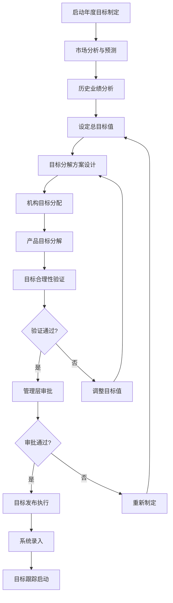
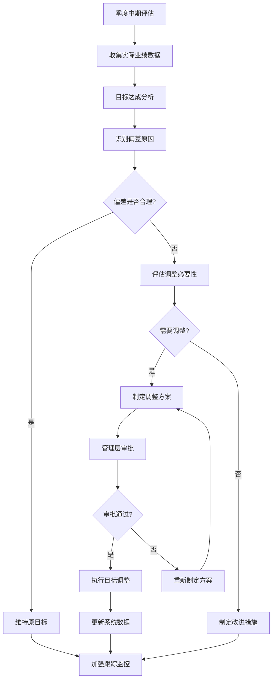
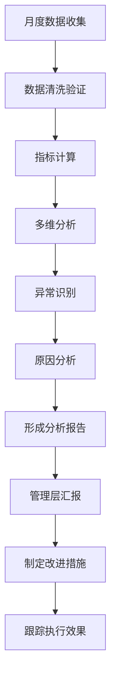
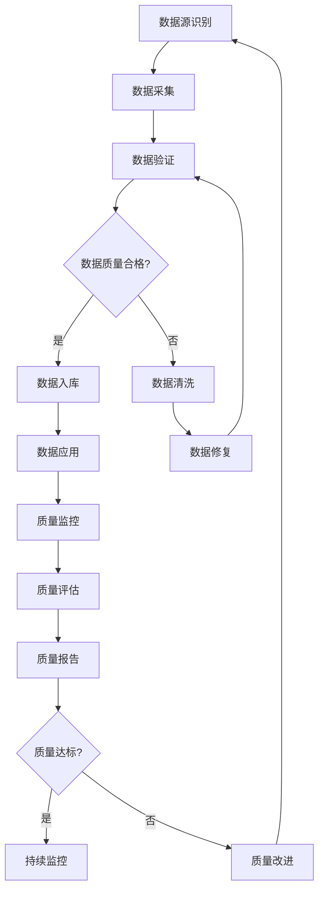
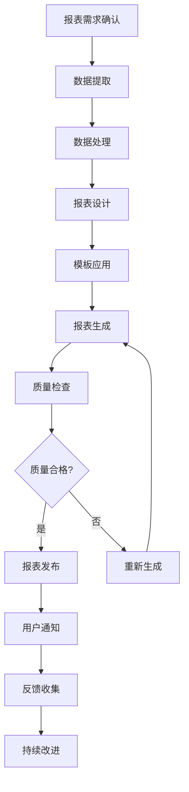
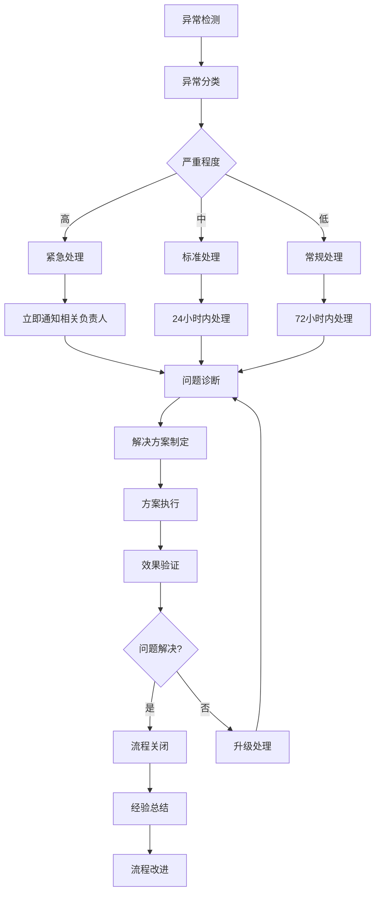

# 📋 业务流程规范

> 川分目标管理系统的核心业务流程定义与执行标准  
**版本:** 2.0.0  
**更新时间:** 2025-12-23  
**适用范围**: 全业务流程

---

## 📑 流程概览

- [目标管理流程](#-目标管理流程)
- [业绩分析流程](#-业绩分析流程)
- [数据管理流程](#-数据管理流程)
- [报表生成流程](#-报表生成流程)
- [异常处理流程](#-异常处理流程)

---

## 🎯 目标管理流程

### 📊 年度目标制定流程



#### 流程步骤详解

**步骤1: 市场分析与预测**
- **责任部门**: 市场部、战略部
- **输入数据**: 
  - 上年度市场数据
  - 行业发展趋势
  - 竞争对手分析
  - 政策法规变化
- **输出成果**: 市场预测报告
- **时间要求**: 每年10月完成
- **质量标准**: 预测准确率≥80%

**步骤2: 历史业绩分析**
- **责任部门**: 财务部、业务部
- **输入数据**: 
  - 过去3年业绩数据
  - 各机构、产品线表现
  - 季节性波动规律
- **输出成果**: 业绩分析报告
- **分析方法**: 趋势分析、同比环比分析
- **关键指标**: CAGR、达成率、波动系数

**步骤3: 设定总目标值**
- **责任部门**: 高管层、财务部
- **决策依据**: 
  - 股东期望回报
  - 公司战略规划
  - 市场预测结果
  - 历史增长趋势
- **目标类型**: 
  - 保费收入目标
  - 利润目标
  - 市场份额目标
  - 增长率目标

**步骤4: 目标分解方案设计**
- **责任部门**: 业务规划部
- **分解原则**: 
  - SMART原则
  - 公平性原则
  - 可实现性原则
  - 激励性原则
- **分解维度**: 
  - 组织维度（省、市、分支机构）
  - 产品维度（车险、财产险等）
  - 时间维度（季度、月度）
  - 渠道维度（直销、中介、网销）

**步骤5: 机构目标分配**
- **分配方法**: 
  - 历史表现权重（40%）
  - 市场潜力权重（30%）
  - 能力评估权重（20%）
  - 战略重点权重（10%）
- **调整机制**: 
  - 特殊情况申请
  - 风险调整系数
  - 新机构扶持政策

### 🔄 季度目标调整流程



#### 调整条件与标准

**必须调整的情况**:
1. 不可抗力影响（自然灾害、政策重大变化）
2. 市场环境剧烈变化（超过±30%）
3. 公司战略重大调整
4. 并购重组等组织变更

**可以调整的情况**:
1. 连续3个月偏差超过±20%
2. 新业务机会出现
3. 资源配置发生重大变化
4. 竞争环境发生重大改变

**调整限制**:
- 单次调整幅度不超过原目标的±30%
- 同一年度调整次数不超过2次
- 调整后目标仍需符合SMART原则

---

## 📈 业绩分析流程

### 📊 月度业绩分析流程



#### 详细流程说明

**数据收集阶段**
```typescript
// 数据收集清单
interface DataCollectionChecklist {
  // 核心业务数据
  coreBusinessData: {
    premiumIncome: '保费收入数据';
    policyCount: '保单数量数据';
    claimAmount: '理赔金额数据';
    expenseAmount: '费用支出数据';
  };
  
  // 辅助分析数据
  auxiliaryData: {
    marketData: '市场占有率数据';
    competitorData: '竞争对手数据';
    economicData: '宏观经济数据';
    customerData: '客户行为数据';
  };
  
  // 数据质量要求
  qualityRequirements: {
    completeness: '数据完整性≥95%';
    accuracy: '数据准确率≥99%';
    timeliness: '数据时效性T+1';
    consistency: '数据一致性检查';
  };
}
```

**指标计算阶段**
```typescript
// 核心分析指标
interface AnalysisMetrics {
  // 基础指标
  basicMetrics: {
    totalPremium: number;        // 总保费
    growthRate: number;          // 增长率
    achievementRate: number;     // 达成率
    marketShare: number;         // 市场份额
  };
  
  // 效率指标
  efficiencyMetrics: {
    profitMargin: number;        // 利润率
    lossRatio: number;           // 赔付率
    expenseRatio: number;        // 费用率
    combinedRatio: number;       // 综合成本率
  };
  
  // 质量指标
  qualityMetrics: {
    retentionRate: number;        // 续保率
    customerSatisfaction: number; // 客户满意度
    policyPersistency: number;   // 保单持续率
    claimFrequency: number;      // 出险频率
  };
}
```

**多维分析框架**
```typescript
// 分析维度定义
interface AnalysisDimensions {
  // 时间维度
  timeDimensions: {
    yearOverYear: '同比分析';
    monthOverMonth: '环比分析';
    rolling12Months: '滚动12个月分析';
    seasonalTrend: '季节性趋势分析';
  };
  
  // 组织维度
  organizationDimensions: {
    provinceLevel: '省级机构分析';
    cityLevel: '市级机构分析';
    branchLevel: '分支机构分析';
    teamLevel: '团队级别分析';
  };
  
  // 产品维度
  productDimensions: {
    mainCategories: '主要产品类别分析';
    subCategories: '细分产品分析';
    newProducts: '新产品表现分析';
    matureProducts: '成熟产品分析';
  };
  
  // 渠道维度
  channelDimensions: {
    directChannel: '直销渠道分析';
    intermediaryChannel: '中介渠道分析';
    onlineChannel: '网销渠道分析';
    partnershipChannel: '合作渠道分析';
  };
}
```

---

## 📊 数据管理流程

### 🔄 数据质量管控流程



#### 数据质量标准

**完整性标准**
- 必填字段完整率 ≥ 99%
- 数据记录完整率 ≥ 95%
- 时间序列连续性 ≥ 98%

**准确性标准**
- 数值型数据误差率 ≤ 1%
- 分类数据准确率 ≥ 99.5%
- 关键业务指标准确率 ≥ 99.9%

**一致性标准**
- 跨系统数据一致性 ≥ 99%
- 时间维度一致性 ≥ 99.5%
- 计算逻辑一致性 100%

**时效性标准**
- 实时数据延迟 ≤ 5分钟
- 日终数据延迟 ≤ 2小时
- 月度数据延迟 ≤ 24小时

### 📊 数据更新流程

```typescript
// 数据更新策略
interface DataUpdateStrategy {
  // 实时数据
  realTimeData: {
    updateFrequency: '5分钟';
    sources: ['核心系统', '交易系统'];
    priority: 'high';
    validation: 'automatic';
  };
  
  // 日终数据
  dailyData: {
    updateFrequency: '每日2:00 AM';
    sources: ['财务系统', '业务系统'];
    priority: 'medium';
    validation: 'semi-automatic';
  };
  
  // 月度数据
  monthlyData: {
    updateFrequency: '每月1日';
    sources: ['月度结算系统', '外部数据源'];
    priority: 'low';
    validation: 'manual';
  };
}
```

---

## 📋 报表生成流程

### 📊 定期报表生成流程



#### 报表分类体系

**按时间周期分类**
```typescript
interface ReportSchedule {
  // 日报表
  daily: {
    frequency: '每日';
    publishTime: '9:00 AM';
    recipients: ['管理层', '业务部门'];
    retention: '1年';
  };
  
  // 周报表
  weekly: {
    frequency: '每周一';
    publishTime: '10:00 AM';
    recipients: ['部门负责人', '产品经理'];
    retention: '2年';
  };
  
  // 月报表
  monthly: {
    frequency: '每月5日前';
    publishTime: '10:00 AM';
    recipients: ['高管层', '董事会'];
    retention: '5年';
  };
  
  // 季报表
  quarterly: {
    frequency: '每季度10日前';
    publishTime: '10:00 AM';
    recipients: ['投资者', '监管机构'];
    retention: '永久';
  };
}
```

**按内容类型分类**
```typescript
interface ReportTypes {
  // 经营分析报表
  businessReports: {
    executiveDashboard: '高管驾驶舱';
    businessOverview: '业务概览';
    performanceAnalysis: '业绩分析';
    trendAnalysis: '趋势分析';
  };
  
  // 财务分析报表
  financialReports: {
    incomeStatement: '损益表';
    balanceSheet: '资产负债表';
    cashFlowStatement: '现金流量表';
    profitabilityAnalysis: '盈利能力分析';
  };
  
  // 运营分析报表
  operationalReports: {
    channelPerformance: '渠道业绩';
    productPerformance: '产品表现';
    customerAnalysis: '客户分析';
    riskAnalysis: '风险分析';
  };
}
```

---

## ⚠️ 异常处理流程

### 🚨 数据异常处理流程



#### 异常分类标准

**数据质量异常**
- 数据缺失：关键字段为空或缺失
- 数据异常：数值超出合理范围
- 数据不一致：同一指标在不同系统中不一致
- 数据延迟：数据更新超时

**业务逻辑异常**
- 业绩异常：达成率异常高或异常低
- 增长异常：增长率超出正常波动范围
- 结构异常：业务结构发生异常变化
- 效率异常：效率指标显著下降

**系统运行异常**
- 系统故障：系统宕机或功能异常
- 性能问题：系统响应缓慢或超时
- 接口异常：数据接口调用失败
- 安全异常：安全事件或数据泄露

### 🔄 异常响应机制

```typescript
// 异常响应配置
interface ExceptionResponse {
  // 响应时间要求
  responseTime: {
    critical: '15分钟内响应';
    high: '1小时内响应';
    medium: '4小时内响应';
    low: '24小时内响应';
  };
  
  // 处理时间要求
  resolutionTime: {
    critical: '4小时内解决';
    high: '24小时内解决';
    medium: '3天内解决';
    low: '7天内解决';
  };
  
  // 通知机制
  notification: {
    critical: ['电话', '短信', '邮件', '系统弹窗'];
    high: ['短信', '邮件', '系统通知'];
    medium: ['邮件', '系统通知'];
    low: ['系统通知'];
  };
  
  // 升级机制
  escalation: {
    level1: '一线技术人员';
    level2: '技术主管';
    level3: '部门经理';
    level4: '公司高管';
  };
}
```

---

## 📊 流程监控与优化

### 📈 流程绩效指标

```typescript
// 流程绩效监控指标
interface ProcessMetrics {
  // 效率指标
  efficiencyMetrics: {
    processCycleTime: '流程周期时间';
    resourceUtilization: '资源利用率';
    automationRate: '自动化率';
    throughput: '处理吞吐量';
  };
  
  // 质量指标
  qualityMetrics: {
    errorRate: '错误率';
    reworkRate: '返工率';
    customerSatisfaction: '客户满意度';
    complianceRate: '合规率';
  };
  
  // 成本指标
  costMetrics: {
    processCost: '流程成本';
    laborCost: '人力成本';
    systemCost: '系统成本';
    opportunityCost: '机会成本';
  };
}
```

### 🔄 持续改进机制

**PDCA循环应用**
1. **计划 (Plan)**: 识别改进机会，制定改进计划
2. **执行 (Do)**: 实施改进措施，监控执行过程
3. **检查 (Check)**: 评估改进效果，对比预期目标
4. **行动 (Act)**: 标准化成功经验，持续优化流程

**流程优化方法**
- 流程再造：根本性重新设计流程
- 流程改进：渐进式优化流程
- 自动化提升：通过技术手段提高效率
- 标准化建设：建立统一的流程标准

---

**文档版本:** 2.0.0  
**更新时间:** 2025-12-23  
**维护团队**: 业务流程团队  
**相关文档**: [业务规则规范](./业务规则规范.md) | [指标定义规范](./指标定义规范.md)